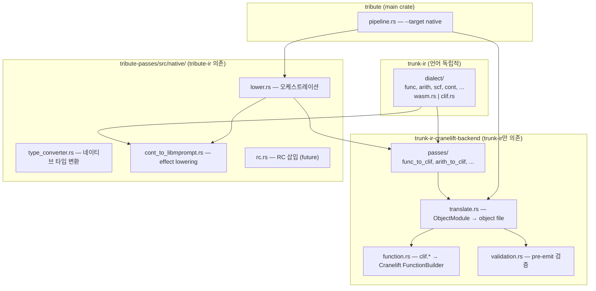
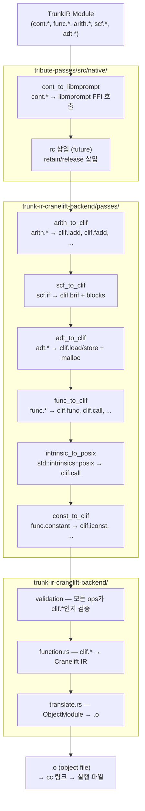

# Cranelift Backend Architecture

> 이 문서는 Tribute → Native 컴파일 백엔드의 아키텍처를 정의한다.
> WASM 백엔드 문서는 [wasm-backend.md](wasm-backend.md)를 참조.

## Overview

Cranelift 백엔드는 WASM 백엔드와 동일한 **2-layer 패턴**을 따른다:

1. **타겟 독립적 IR 유지**: trunk-ir는 특정 타겟에 종속되지 않음
2. **Backend-specific lowering**: `clif.*` dialect은 Cranelift IR과 1:1 대응
3. **관심사 분리**: lowering (tribute-passes/native)과
   emission (trunk-ir-cranelift-backend) 분리

---

## 크레이트 구조



---

## Lowering 경로

### Native 타겟



### WASM 타겟과 비교

| 측면 | WASM | Native |
| ---- | ---- | ------ |
| Effect | trampoline (yield bubbling) | libmprompt (스택 관리) |
| 메모리 | WasmGC (런타임 GC) | Reference Counting |
| ADT | GC struct/array | 포인터 + load/store |
| 제어 흐름 | Structured (block/loop/if) | CFG (brif/jump/br_table) |
| 함수 참조 | funcref + table | 함수 포인터 |
| 출력 | `.wasm` binary | `.o` object file |

---

## `clif.*` Dialect

Cranelift IR과 1:1 대응하는 저수준 연산. 전체 연산 목록은 [ir.md](ir.md#clif-dialect)를 참조.

핵심 차이점 (`wasm.*` 대비):

- **GC 타입 없음**: struct/array 대신 포인터 + load/store
- **CFG 기반**: structured control flow 대신 brif/jump/br_table
- **스택 할당**: stack_slot으로 로컬 메모리 할당 가능
- **함수 포인터**: funcref 대신 symbol_addr로 함수 주소 획득

---

## Effect 구현: libmprompt

WASM의 trampoline 방식과 달리, libmprompt가 스택 자체를 관리하므로
라이브 변수 캡처/state struct가 불필요하다.

상세 내용은 [implementation.md](implementation.md#cranelift-libmprompt)를 참조.

---

## 메모리 관리: Reference Counting

상세 내용은 [implementation.md](implementation.md#cranelift-reference-counting)를 참조.

### ADT 메모리 레이아웃

```text
Struct: [fields in order, naturally aligned]
Enum:   [tag: i32] [padding] [payload: max(variant sizes)]
Array:  [length: i64] [elements...]
```

### RC Object 헤더

```text
[-8 bytes] refcount: u32 + type_id: u32
[ 0 bytes] first field
```

---

## 구현 단계

### Phase 1: 기본 함수 컴파일

- `clif` dialect 정의
- `trunk-ir-cranelift-backend` 크레이트 스캐폴딩
- `func_to_clif` + `arith_to_clif` passes
- Cranelift codegen (function.rs + translate.rs)
- `fn main() -> Int { 42 }` → object file

### Phase 2: 제어 흐름 + ADT + 클로저

- `scf_to_clif` pass (CFG 변환)
- `adt_to_clif` pass (malloc/free 기반)
- 간접 호출 (call_indirect)
- if/case/loop, struct/enum 지원

### Phase 3: Reference Counting

- RC retain/release 삽입 pass
- Valgrind / AddressSanitizer 검증

### Phase 4: libmprompt 기반 Effect

- `cont_to_libmprompt` pass
- Evidence 런타임 (native)
- libmprompt 정적 링킹

### Phase 5: E2E 파이프라인

- `tribute compile --target native file.trb` → 실행 파일
- E2E 테스트 (ability 포함)

---

## References

- [libmprompt](https://github.com/koka-lang/libmprompt)
  — Koka 언어의 delimited continuation 런타임
- [Cranelift](https://cranelift.dev/) — Rust로 작성된 코드 생성기
- [wasm-backend.md](wasm-backend.md) — WASM 백엔드 아키텍처 (대칭 구조)
