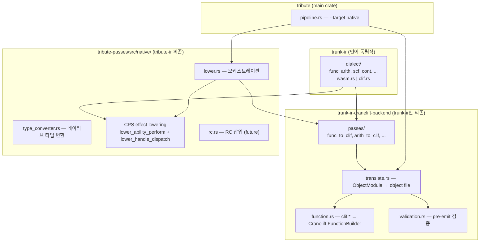

# Cranelift Backend Architecture

> 이 문서는 Tribute → Native 컴파일 백엔드의 아키텍처를 정의한다.
> WASM 백엔드 문서는 [wasm-backend.md](wasm-backend.md)를 참조.

## Overview

Cranelift 백엔드는 WASM 백엔드와 동일한 **2-layer 패턴**을 따른다:

1. **타겟 독립적 IR 유지**: trunk-ir는 특정 타겟에 종속되지 않음
2. **Backend-specific lowering**: `clif.*` dialect은 Cranelift IR과 1:1 대응
3. **관심사 분리**: lowering (tribute-passes/native)과
   emission (trunk-ir-cranelift-backend) 분리

---

## 크레이트 구조


```mermaid
graph TD
    subgraph "trunk-ir (언어 독립적)"
        dialects["dialect/\nfunc, arith, scf, cont, ...\nwasm.rs | clif.rs"]
    end

    subgraph "trunk-ir-cranelift-backend (trunk-ir만 의존)"
        translate["translate.rs — ObjectModule → object file"]
        function["function.rs — clif.* → Cranelift FunctionBuilder"]
        validation["validation.rs — pre-emit 검증"]
        passes["passes/\nfunc_to_clif, arith_to_clif, ..."]
    end

    subgraph "tribute-passes/src/native/ (tribute-ir 의존)"
        lower["lower.rs — 오케스트레이션"]
        type_conv["type_converter.rs — 네이티브 타입 변환"]
        cps["CPS effect lowering\nlower_ability_perform + lower_handle_dispatch"]
        rc["rc.rs — RC 삽입 (future)"]
    end

    subgraph "tribute (main crate)"
        pipeline["pipeline.rs — --target native"]
    end

    dialects --> passes
    dialects --> cps
    passes --> translate
    translate --> function
    translate --> validation
    lower --> passes
    lower --> cps
    pipeline --> lower
    pipeline --> translate
```

---

## Lowering 경로

String constant lowering reads the exact prelude `String` `TypeRef` from the
root module's `tribute.type.string` metadata. It does not search interned
ADT types by `String`, `Leaf`/`Branch`, or representation layout. Missing
metadata is a lowering error whenever `adt.string_const` is present; this keeps
hand-written or text-round-tripped IR from silently selecting a user lookalike.

### Private List layout

The native backend must eliminate shared `list.*` operations before the
backend-ready boundary. It lowers them to a private immutable RC-managed RRB
tree. A representative physical shape is:

```text
root          = RC object [length, depth, root_node, tail_leaf]
internal node = RC object [child_count, cumulative_sizes, children...]
leaf node     = RC object [element_count, elements...]
```

The exact branching factor, packing, and empty sentinel are target-private and
are not an `adt.enum List` contract. Frontend/shared IR never names RRB node
fields. Node allocation uses the standard RC header, RTTI, retain/release
insertion, and deep-release path. Internal nodes own their children and leaves
own reference-typed elements. Sequence observations preserve order and
persistence without exposing this layout.

### Native 타겟


```mermaid
flowchart TB
    input["TrunkIR Module\n(func.*, arith.*, scf.*, adt.*, evidence runtime calls)"]

    subgraph native_passes["tribute-passes/src/native/"]
        cont["CPS effect lowering\nlower_ability_perform + lower_handle_dispatch"]
        list_lower["opaque List lowering\nnative::list::lower\nlist.* → private RC nodes"]
        cfg["structured control normalization\nscf_to_cf"]
        rc_plan["typed ownership/RTTI plan\nsemantic type + CFG"]
        rc_pass["explicit RC materialization\nretain/release 삽입"]
    end

    subgraph clif_passes["trunk-ir-cranelift-backend/passes/"]
        arith["arith_to_clif\narith.* → clif.iadd, clif.fadd, ..."]
        cf["cf_to_clif\ncf.* → clif.brif/jump + blocks"]
        adt["adt_to_clif\nadt.* → clif.load/store + malloc"]
        func["func_to_clif\nfunc.* → clif.func, clif.call, ..."]
        intrinsic["intrinsic_to_posix\nstd::intrinsics::posix → clif.call"]
        const_pass["const_to_clif\nfunc.constant → clif.iconst, ..."]
    end

    subgraph emit["trunk-ir-cranelift-backend/"]
        validate["validation — 모든 ops가 clif.*인지 검증"]
        codegen["function.rs — clif.* → Cranelift IR"]
        obj["translate.rs — ObjectModule → .o"]
    end

    output[".o (object file)\n→ cc 링크 → 실행 파일"]

    input --> cont --> list_lower --> cfg --> rc_plan --> rc_pass
    rc_pass --> arith --> cf --> adt --> func --> intrinsic --> const_pass
    const_pass --> validate --> codegen --> obj --> output
```

### WASM 타겟과 비교

| 측면 | WASM | Native |
| ---- | ---- | ------ |
| Effect | CPS tail-call handling | CPS tail-call handling |
| 메모리 | WasmGC (런타임 GC) | Reference Counting |
| ADT | GC struct/array | 포인터 + load/store |
| 제어 흐름 | Structured (block/loop/if) | CFG (brif/jump/br_table) |
| 함수 참조 | funcref + table | 함수 포인터 |
| 출력 | `.wasm` binary | `.o` object file |

---

## `clif.*` Dialect

Cranelift IR과 1:1 대응하는 저수준 연산. 전체 연산 목록은 [ir.md](ir.md#clif-dialect)를 참조.

핵심 차이점 (`wasm.*` 대비):

- **GC 타입 없음**: struct/array 대신 포인터 + load/store
- **CFG 기반**: structured control flow 대신 brif/jump/br_table
- **스택 할당**: stack_slot으로 로컬 메모리 할당 가능
- **함수 포인터**: funcref 대신 symbol_addr로 함수 주소 획득

### Zero-width `core.nil`

`core.nil` is a logical TrunkIR `Unit` SSA value but has no runtime
representation in Cranelift. The native emitter therefore omits nil values
from function signatures, entry and non-entry block parameters, CFG edge
operands, direct and indirect call operands, and direct and indirect tail-call
operands. It preserves the ordering of all non-nil parameters and operands,
including the non-nil indirect callee, while leaving logical TrunkIR
unchanged. Nil returns, constants, and return operands follow the same
zero-width convention.

---

## Effect 구현: CPS Tail-Call

Effect handling은 tail-call CPS 방식으로 처리된다.
`lower_ability_perform`과 `lower_handle_dispatch` pass가
ability 연산을 handler_dispatch 클로저 호출로 변환한다.

상세 내용은 [cps-effects.md](cps-effects.md)를 참조.

---

## 메모리 관리: Reference Counting

상세 내용은 [implementation.md](implementation.md#cranelift-reference-counting)를 참조.

Private native runtime helper는 target stage에서 exact physical callable ABI로만
선언한다. 이 helper의 parameter와 result는 `core.ptr` 또는 scalar physical type이며
`adt.typeref`를 사용할 수 없다. Source-logical managed reference와 private runtime
pointer 사이의 경계는 이름, `abi` 문자열 또는 symbol 위치로 추론하지 않는다.

Native ownership/RTTI plan은 `scf_to_cf` 뒤와 `func_to_clif` 앞에서 한 번 만들며
IR을 변경하지 않는다. `adt.typeref`와 compiler-generated managed layout의 semantic
type, exact callable contract와 CFG liveness만 사용한다. RTTI deep-release field와
entry/call/store/load/final-use/tail action은 이 plan에 함께 들어간다. 이후
`core.ptr`는 이미 선택된 explicit RC operation의 physical operand일 뿐이다.

Native RC materialization은 같은 type-erasure 전 경계에서 검증된 plan을 즉시
소비한다. IR을 바꾸기 전에 전체 insertion schedule을 검증하며, `func_to_clif`
뒤에는 ownership, liveness, pointer provenance를 다시 발견하는 pass를 실행하지
않는다.

### ADT 메모리 레이아웃

```text
Struct: [fields in order, naturally aligned]
Enum:   [tag: i32] [padding] [payload: max(variant sizes)]
Array:  [length: i64] [elements...]
```

### RC Object 헤더

```text
[-8 bytes] refcount: u32 + type_id: u32
[ 0 bytes] first field
```

---

## 구현 단계

### Phase 1: 기본 함수 컴파일

- `clif` dialect 정의
- `trunk-ir-cranelift-backend` 크레이트 스캐폴딩
- `func_to_clif` + `arith_to_clif` passes
- Cranelift codegen (function.rs + translate.rs)
- `fn main() -> Int { 42 }` → object file

### Phase 2: 제어 흐름 + ADT + 클로저

- `scf_to_clif` pass (CFG 변환)
- `adt_to_clif` pass (malloc/free 기반)
- 간접 호출 (call_indirect)
- if/case/loop, struct/enum 지원

### Phase 3: Reference Counting

- RC retain/release 삽입 pass
- Valgrind / AddressSanitizer 검증

### Phase 4: CPS Tail-Call Effect Handling

- `lower_ability_perform` + `lower_handle_dispatch` passes
- Evidence 런타임 (native): `new-plans/cps-effects.md`의 Marker layout과
  `__tribute_evidence_*` C ABI를 따른다.

### Phase 5: E2E 파이프라인

- `tribute compile --target native file.trb` → 실행 파일
- E2E 테스트 (ability 포함)

### Phase 6: Native Basic I/O

- shared `tribute_io.write`와 `tribute_io.read_line`을
  [io.md](io.md#native-runtime-abi)의 private runtime ABI로 낮춘다.
- Runtime descriptor를 high-level `ReadLineResult` ADT로 바꾼 뒤 기존 SCF, ADT,
  memory lowering을 적용한다.
- Native runtime은 Tribute enum/RTTI layout에 의존하지 않는다.
- E2E 테스트는 subprocess stdin에 raw bytes를 주입하여 빈 줄, partial EOF, EOF,
  invalid UTF-8을 검증한다.

---

## References

- [Cranelift](https://cranelift.dev/) — Rust로 작성된 코드 생성기
- [wasm-backend.md](wasm-backend.md) — WASM 백엔드 아키텍처 (대칭 구조)
