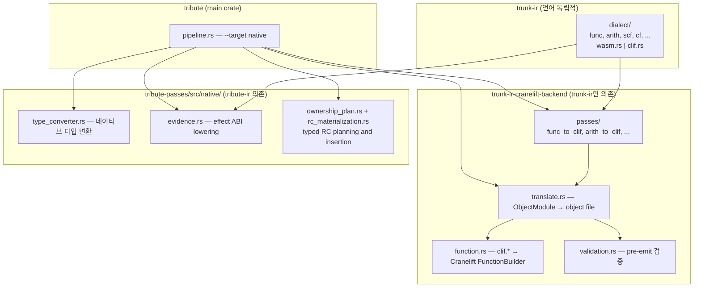
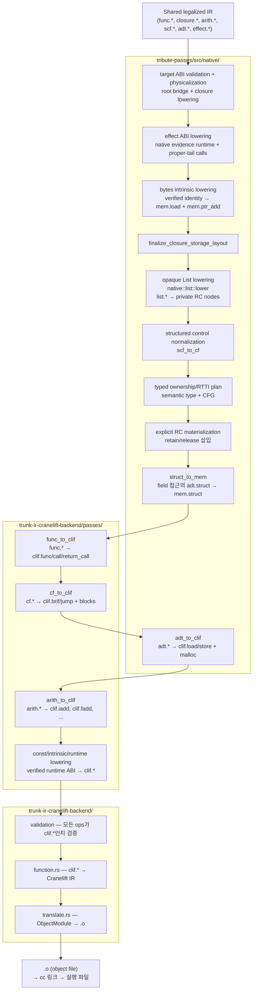

# Cranelift Backend Architecture

> 이 문서는 Tribute → Native 컴파일 백엔드의 아키텍처를 정의한다.
> WASM 백엔드 문서는 [wasm-backend.md](wasm-backend.md)를 참조.

## Overview

Cranelift 백엔드는 WASM 백엔드와 동일한 **lowering/emission 분리**을 따른다:

1. **타겟 독립적 IR 유지**: trunk-ir는 특정 타겟에 종속되지 않음
2. **Backend-specific lowering**: `clif.*` dialect은 Cranelift IR의 명령과
   `cranelift-frontend`가 제공하는 구성에 1:1 대응
3. **관심사 분리**: lowering (tribute-passes/native)과
   emission (trunk-ir-cranelift-backend) 분리

---

## 크레이트 구조


```mermaid
graph TD
    subgraph "trunk-ir (언어 독립적)"
        dialects["dialect/\nfunc, arith, scf, cf, ...\nwasm.rs | clif.rs"]
    end

    subgraph "trunk-ir-cranelift-backend (trunk-ir만 의존)"
        translate["translate.rs — ObjectModule → object file"]
        function["function.rs — clif.* → Cranelift FunctionBuilder"]
        validation["validation.rs — pre-emit 검증"]
        passes["passes/\nfunc_to_clif, arith_to_clif, ..."]
    end

    subgraph "tribute-passes/src/native/ (tribute-ir 의존)"
        type_conv["type_converter.rs — 네이티브 타입 변환"]
        effects["evidence.rs — effect ABI lowering"]
        rc["ownership_plan.rs + rc_materialization.rs\ntyped RC planning and insertion"]
    end

    subgraph "tribute (main crate)"
        pipeline["pipeline.rs — --target native"]
    end

    dialects --> passes
    dialects --> effects
    passes --> translate
    translate --> function
    translate --> validation
    pipeline --> passes
    pipeline --> effects
    pipeline --> rc
    pipeline --> type_conv
    pipeline --> translate
```

---

## Lowering 경로

String constant lowering reads the exact prelude `String` `TypeRef` from the
root module's `tribute.type.string` metadata. It does not search interned
ADT types by `String`, `Leaf`/`Branch`, or representation layout. Missing
metadata is a lowering error whenever `adt.string_const` is present; this keeps
hand-written or text-round-tripped IR from silently selecting a user lookalike.

### Private List layout

The native backend must eliminate shared `list.*` operations before the
backend-ready boundary. It lowers them to a private immutable RC-managed RRB
tree. A representative physical shape is:

```text
root          = RC object [length, depth, root_node, tail_leaf]
internal node = RC object [child_count, cumulative_sizes, children...]
leaf node     = RC object [element_count, elements...]
```

The exact branching factor, packing, and empty sentinel are target-private and
are not an `adt.enum List` contract. Frontend/shared IR never names RRB node
fields. Node allocation uses the standard RC header, RTTI, retain/release
insertion, and deep-release path. Internal nodes own their children and leaves
own reference-typed elements. Sequence observations preserve order and
persistence without exposing this layout.

### Native 타겟


```mermaid
flowchart TB
    input["Shared legalized IR\n(func.*, closure.*, arith.*, scf.*, adt.*, effect.*)"]

    subgraph native_passes["tribute-passes/src/native/"]
        abi["target ABI validation + physicalization\nroot bridge + closure lowering"]
        effect["effect ABI lowering\nnative evidence runtime + proper-tail calls"]
        bytes["bytes intrinsic lowering\nverified identity → mem.load + mem.ptr_add"]
        storage["finalize_closure_storage_layout"]
        list_lower["opaque List lowering\nnative::list::lower\nlist.* → private RC nodes"]
        cfg["structured control normalization\nscf_to_cf"]
        rc_plan["typed ownership/RTTI plan\nsemantic type + CFG"]
        rc_pass["explicit RC materialization\nretain/release 삽입"]
        structural["struct_to_mem\nfield 접근의 adt.struct → mem.struct"]
        adt["adt_to_clif\nadt.* → clif.load/store + malloc"]
    end

    subgraph clif_passes["trunk-ir-cranelift-backend/passes/"]
        arith["arith_to_clif\narith.* → clif.iadd, clif.fadd, ..."]
        cf["cf_to_clif\ncf.* → clif.brif/jump + blocks"]
        func["func_to_clif\nfunc.* → clif.func/call/return_call"]
        intrinsic["const/intrinsic/runtime lowering\nverified runtime ABI → clif.*"]
    end

    subgraph emit["trunk-ir-cranelift-backend/"]
        validate["validation — 모든 ops가 clif.*인지 검증"]
        codegen["function.rs — clif.* → Cranelift IR"]
        obj["translate.rs — ObjectModule → .o"]
    end

    output[".o (object file)\n→ cc 링크 → 실행 파일"]

    input --> abi --> effect --> bytes --> storage --> list_lower --> cfg --> rc_plan --> rc_pass
    rc_pass --> structural --> func --> cf --> adt --> arith --> intrinsic
    intrinsic --> validate --> codegen --> obj --> output
```

### WASM 타겟과 비교

| 측면 | WASM | Native |
| ---- | ---- | ------ |
| Effect | CPS tail-call handling | CPS tail-call handling |
| 메모리 | WasmGC (런타임 GC) | Reference Counting |
| ADT | GC struct/array | 포인터 + load/store |
| 제어 흐름 | Structured (block/loop/if) | CFG (brif/jump/br_table) |
| 함수 참조 | funcref + table | 함수 포인터 |
| 출력 | `.wasm` binary | `.o` object file |

---

## `clif.*` Dialect

Cranelift와 1:1 대응하는 저수준 연산. 각 operation은 Cranelift IR의 명령 하나나
`cranelift-frontend`가 제공하는 구성 하나에 대응한다. 예를 들어 `clif.br_table`은
`br_table` 명령에, `clif.switch`는 `cranelift_frontend::Switch`에 대응한다.
Operation의 이름과 의미는 대응하는 대상을 따르며, Cranelift에 대응 대상이 없는
operation은 이 dialect에 두지 않는다. 전체 연산 목록은
[ir.md](ir.md#clif-dialect)를 참조.

핵심 차이점 (`wasm.*` 대비):

- **GC 타입 없음**: struct/array 대신 포인터 + load/store
- **CFG 기반**: structured control flow 대신 brif/jump/br_table
- **스택 할당**: stack_slot으로 로컬 메모리 할당 가능
- **함수 포인터**: funcref 대신 symbol_addr로 함수 주소 획득

### `clif.br_table` jump table 분기

`clif.br_table`은 Cranelift의 `br_table` 명령과 같은 의미를 가진다.

```text
clif.br_table %index [^default, ^entry0, ^entry1, ^entry2]
```

- Successor는 `default`가 먼저이고, 그 뒤가 0번부터의 table 항목이다.
- `index`는 부호 없는 32비트 정수다. Table 범위 안이면 그 위치의 successor로,
  범위를 벗어나면 `default`로 분기한다.
- Successor는 block argument를 받지 않는다. 값을 넘겨야 하는 분기는
  `clif.jump`로 끝나는 블록을 거친다.

연속이 아닌 값이나 0에서 시작하지 않는 값에 대한 분기는 `clif.switch`가 표현한다.

### `clif.switch` 다중 분기

`clif.switch`는 `cranelift_frontend::Switch`와 같은 의미를 가진다.

```text
clif.switch %index [^default, ^a, ^b, ^c] {cases = [0, 1, 7]}
```

- Successor는 `default`가 먼저이고, 그 뒤로 `cases`의 값마다 하나씩 같은 순서로
  온다. `cases`의 길이와 대상 successor의 수는 같다.
- `index`는 정수이며 부호 없는 값으로 비교한다. `cases`의 한 값과 같으면 그
  위치의 successor로, 어느 값과도 같지 않으면 `default`로 분기한다.
- Case 값은 서로 달라야 하고 `index` 타입의 부호 없는 범위 안에 있어야 한다.
  연속이거나 0에서 시작할 필요는 없다.
- Successor는 block argument를 받지 않는다.

Jump table, 비교 분기, 또는 둘의 조합 중 무엇을 방출할지는 `Switch`가 case 값의
분포를 보고 정한다. Operation은 그 선택을 표현하지 않는다.

`cf.switch`는 `clif.switch`로 내려간다. `cf.switch`의 case는 discriminant 타입의
값이고 `clif.switch`는 부호 없는 값으로 비교하므로, 각 case는 discriminant 폭에서의
비트열이 된다.

### `clif.func_sig` 네이티브 호출 계약

네이티브 lowering은 공통 callable type을 유지하지 않고 `clif.func_sig`를 소유한다.
계약은 순서 있는 입력 뒤에 순서 있는 결과를 평탄한 벡터에 저장하고, 필수 `u32`
`num_inputs`와 `num_results` 속성으로 경계를 구분한다. 두 delimiter와 예약되지 않은
타입 속성은 타입 동일성에 참여하며, delimiter는 ABI나 CPS marker가 아니다. 네이티브
함수 정의와 선언, 직접·exact indirect call, return, tail transfer, emission은 이
target-owned contract를 소비한다. 호출 계약 변환은 그 내부의 중첩 타입 메타데이터를
보존하고, 타입이 지워진 함수 포인터, 심볼, ABI 문자열, 저장 형태에서 exact contract를
추론하지 않는다.

네이티브 최종 호출 계약의 각 operand와 result slot은 `clif.func_sig`의 같은 순서
slot과 정확히 같은 TrunkIR type이어야 한다. semantic reference SSA 값은 native
lowering이 그 producer 또는 block argument를 `core.ptr`로 명시적으로 낮춘 뒤에만
`core.ptr` slot을 채울 수 있다. 검증과 emission은 dialect 이름, type attribute, ABI
문자열, symbol, erased representation에서 pointer 동치를 추론하지 않는다. 이 규칙은
`core.nil`의 정해진 zero-width projection과 별개이며, 다른 contract type 사이의
호환성 규칙을 만들지 않는다.

### 모듈 수준 data 선언

`clif.func`처럼 `clif.data`도 Cranelift 명령어가 아니라 object 모듈 수준의
선언이다. `clif.data`는 module-local 읽기 전용 data object의 기호, 바이트 내용,
정렬을 가진다. Operation을 낮추는 단계는 자신이 `clif.symbol_addr`로 참조하는
data object를 같은 단계에서 `clif.data`로 선언하며, 같은 내용과 정렬의 선언이
이미 있으면 재사용한다. Emission은 IR에 선언된 `clif.data`만 object에 정의하고,
앞 단계의 입력에서 정한 배치를 IR 밖으로 넘겨받지 않는다.

`clif` dialect는 cranelift-codegen 명령어와 cranelift-module 선언을 함께
표현하며, 모듈 수준 선언을 위한 별도 dialect를 두지 않는다.

`clif.data`의 선택적 region은 재배치 선언 목록이다. Region 안의 각
`clif.func_reloc {offset, func}`는 cranelift-module `DataDescription`의 함수
재배치와 같은 의미를 갖는다. 바이트는 object의 실제 내용이고, 링커가 offset의
포인터 폭 바이트를 `func` 함수의 주소로 덮어쓴다. 이 region은 실행되는 코드가 아니므로
재배치 선언만 담으며, `clif.func_reloc`은 `clif.data` region 밖에 올 수 없다.
재배치마다 덮어쓰는 포인터 폭 구간은 바이트 안에 들어가야 하고 서로 겹치지 않아야
하며, 대상은 모듈에 선언된 함수여야 한다.

### Bodyless 선언의 바인딩

Callable의 선언·정의·malformed 분류는 [공통 본문 구조](ir.md#callable-본문-구조)를
따른다. Native 최종 경계에서 bodyless `clif.func`는 외부 바인딩을 나타내는 `abi`가
필수이며, 없으면 함수 identity와 바인딩 누락을 진단한다. 본문과 `abi`가 함께 있는
`clif.func`도 모순된 입력으로 거부한다. 이 규칙은 target emission의 계약이며,
target 이전 ownership planner의 bodyless signature 검증에 바인딩 조건을 추가하지
않는다. Runtime helper의 외부 선언을 생성하는 producer도 region 없이 생성하며,
`unreachable` 가짜 본문을 외부 바인딩 표기로 사용하지 않는다.

Emitter는 바인딩된 선언을 import로 등록하고, 참조가 없어도 보존한다. 선언의 입력이나
결과 타입을 native 시그니처로 변환할 수 없으면 함수 identity와 변환 오류를 진단하며,
무참조 선언이라는 이유로 오류를 숨기거나 선언을 생략하지 않는다. 함수는
[root 기준 qualified name](ir.md#core-invariants)으로 등록하고 참조를 해석한다. 정의는
root module의 `main`이면 export하고, 그 밖에는 qualified name에서 만든 local linkage
이름으로 등록한다. 외부 바인딩 선언은 자신의 `sym_name`으로 링크한다. Define pass는 공통 구조
판정으로 선언을 건너뛰고 정의의 본문만 생성한다. `abi` 유무로 본문을 추정하거나
없는 본문에 접근하지 않는다. 이 처분은 IR이나 `global_dce`의 reachability root를
변경하지 않는다.

### Zero-width `core.nil`

`core.nil`은 논리 TrunkIR `Unit` SSA 값이지만 Cranelift runtime representation은 없다.
따라서 native emitter는 함수 시그니처, entry와 non-entry block parameter, CFG edge
operand, 직접·간접 call operand, 직접·간접 tail-call operand에서 nil을 생략한다.
논리 TrunkIR는 바꾸지 않은 채 non-nil parameter와 operand의 순서(간접 호출의 non-nil
callee 포함)를 보존한다. Nil return, constant, return operand에도 같은 zero-width
규칙이 적용된다.

---

## Effect 구현: CPS Tail-Call

Shared `tribute_control_to_cps`가 continuation과 proper tail transfer를 만든다.
Shared ability/evidence lowering은 그 결과를 `effect.*` ABI로 바꾼다.
Native target은 exact callable contract를 검증하고 CPS signature를 물리화한 뒤
`native/evidence`에서 runtime lookup/extension과 handler closure 호출을 생성한다.
이어서 closure storage layout을 확정하고 경계 출구를 검증하며, 여기까지가
`lower_to_clif` 이전의 [representation/ABI 경계](ir.md#representationabi-경계)이다.
`func_to_clif`는 proper transfer operation을 `clif.return_call`과
`clif.return_call_indirect`로 내리고, Cranelift 호출 규약은 signature의
`call_conv`에서만 정한다.

경계 안의 물리 CPS 판정은 exact `Cps` convention과 빈 결과 목록의 조합이며,
경계 이후에는 `call_conv = "tail"` signature와 proper-tail operation만 남는다. 실제
Direct/EvidenceDirect Unit 결과와 살아 있는 nil SSA 값의 zero-width 처리는 유지한다.
최종 dispatch는 operand와 독립적인 compiler-owned canonical shared signature를
기존 Native 변환으로 낮추며 machine 입력은 `ptr, ptr, ptr, i32, i32, i32, ptr`,
결과는 빈 목록이다. Operand는 이 고정 계약과 정확히 대조한다.

상세 내용은 [cps-effects.md](cps-effects.md)를 참조.

---

## 메모리 관리: Reference Counting

상세 내용은 [implementation.md](implementation.md#cranelift-reference-counting)를 참조.

Private native runtime helper는 target stage에서 exact physical callable ABI로만
선언한다. 이 helper의 parameter와 result는 `core.ptr` 또는 scalar physical type이며
`adt.typeref`를 사용할 수 없다. Source-logical managed reference와 private runtime
pointer 사이의 경계는 이름, `abi` 문자열 또는 symbol 위치로 추론하지 않는다.

Native ownership/RTTI plan은 `scf_to_cf` 뒤와 `func_to_clif` 앞에서 한 번 만들며
IR을 변경하지 않는다. `adt.typeref`와 compiler-generated managed layout의 semantic
type, exact callable contract와 CFG liveness만 사용한다. RTTI deep-release field와
entry/call/store/load/final-use/tail action은 이 plan에 함께 들어간다. 이후
`core.ptr`는 이미 선택된 explicit RC operation의 physical operand일 뿐이다.

Plan의 RTTI 배치는 plan을 만든 직후 descriptor(struct layout, 또는 enum layout의
variant 하나)마다 하나의 `tribute_rtti.layout` 선언으로 모듈에 기록한다. 선언이
담는 내용은 [runtime-types.md](runtime-types.md#ir에서의-표현)를 따른다. index는
plan의 할당 순서대로 사용자 RTTI index 공간에서 정한다. Closure layout(`layout = "closure"`)을
native closure layout으로 바꾸는 일은 Tribute target 단계가 소유하며, 할당 op과
그 layout의 RTTI 선언을 함께 바꾼다. RTTI 생성은 선언이 모든 할당 descriptor를 정확히
한 번씩 이름 붙이는지 검사한 뒤, descriptor별 release 함수, index마다 release 함수
주소와 descriptor 내용을 담는 RTTI table(`clif.data`와 재배치), table을 통해 해제를 디스패치하는
`__tribute_deep_release`를 IR에 선언한다. `struct_to_mem`은 struct와 variant field
접근의 nominal layout을 [`mem.struct`](ir.md#nominal-수준과-structural-수준)로 바꾸며, 선언의
필드 종류에서 해제되는 필드를 읽는다. 같은 단계가 variant 판별을 값의 descriptor
번호(`tribute_rtti.descriptor`)와 선언된 번호의 정수 비교로 바꾼다. Descriptor 번호를
읽는 연산은 managed 참조만 받으며, native 타입 변환이 그 참조를 pointer로 바꾸기
전에 RC header의 index를 읽는 `clif.load`가 된다. 비교는 일반 정수 비교로
내려간다. RC header lowering은 선언된 index를
header에 기록하고 선언을 지운다. Backend는 RTTI 이름 규칙을 알지 않는다.

Native RC materialization은 같은 type-erasure 전 경계에서 검증된 plan을 즉시
소비한다. Evidence runtime에 저장할 managed `_closure`는 이 경계에서만
`tribute_rt.into_raw`로 ownership unit 하나를 transfer하며, 이후 명시적 conversion이
이를 unmanaged `core.ptr`로 낮춘다. IR을 바꾸기 전에 전체 insertion schedule을 검증하며,
`func_to_clif` 뒤에는 ownership, liveness, pointer provenance를 다시 발견하는 pass를
실행하지 않는다.

### ADT 메모리 레이아웃

```text
Struct: [fields in order, naturally aligned]
Enum:   [the variant's fields in order, naturally aligned], sized per variant
Array:  [length: i64] [elements...]
```

### RC Object 헤더

```text
[-8 bytes] refcount: u32 + type_id: u32
[ 0 bytes] first field
```

---

## Native I/O

Shared `tribute_io.write`와 `tribute_io.read_line`은
[io.md](io.md#native-runtime-abi)의 private runtime ABI로 낮춘다. Runtime descriptor를
high-level `ReadLineResult` ADT로 바꾼 뒤 SCF, ADT, memory lowering을 적용한다.
Native runtime은 Tribute enum/RTTI layout에 의존하지 않는다. E2E 검증은 subprocess
stdin의 raw bytes로 빈 줄, partial EOF, EOF, invalid UTF-8을 확인한다.

---

## References

- [Cranelift](https://cranelift.dev/) — Rust로 작성된 코드 생성기
- [wasm-backend.md](wasm-backend.md) — WASM 백엔드 아키텍처 (대칭 구조)
