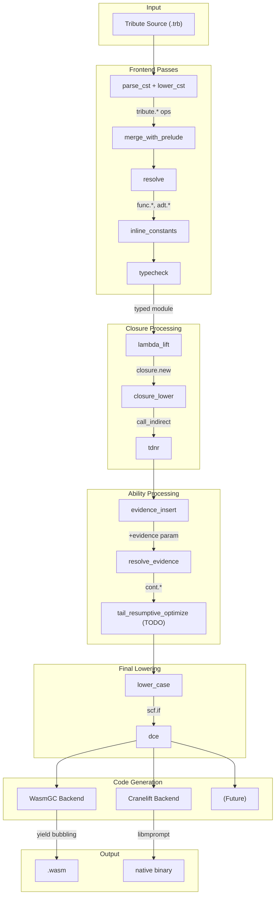

# Tribute Ability Implementation

> 이 문서는 Tribute의 ability 시스템 구현 전략을 정의한다.

## Design Decisions

### 결정 사항 요약

| 항목 | 선택 | 대안 (채택하지 않음) |
| ---- | ---- | -------------------- |
| 의미론 | 동적 (호출 시점 핸들러) | 정적 (생성 시점 캡처) |
| 핸들러 디스패치 | Evidence passing | 런타임 스택 탐색 |
| Continuation | One-shot, scoped | Multi-shot |
| Polymorphic 함수 | Evidence 전달 | Monomorphization, 전면 CPS |
| Evidence 구조 | 포인터 전달 + 정렬된 slice | bitmap, HashMap, 연결 리스트 |
| GC (Cranelift) | Boehm GC (초기) | Custom tracing GC |
| GC (WasmGC) | 런타임 내장 GC | - |

---

## Semantic Model

### 동적 의미론

클로저의 ability는 **호출 시점**에 해소된다:

```rust
fn make_counter() ->{State(Int)} fn() ->{State(Int)} Int {
    fn() {
        let n = State::get()
        State::set(n + 1)
        n
    }
}

// 사용
let counter = run_state(fn() make_counter(), 0)
// counter: fn() ->{State(Int)} Int

// 다른 State 핸들러 아래에서 호출
run_state(fn() {
    counter()  // 이 시점의 State 핸들러 사용
    counter()
}, 100)
```

클로저 타입에 `->{State(Int)}`가 명시되어 있으므로, 호출하는 쪽에서
State 핸들러를 제공해야 한다. 이는 일반 함수 호출과 동일한 계약이다.

### Scoped Resumption

Continuation은 자신을 캡처한 handler 스코프 내에서만 resume될 수 있다:

```rust
// OK: 같은 handler 스코프 내에서 resume
fn run_state(comp: fn() ->{e, State(s)} a, init: s) ->{e} a {
    handle comp() {
        { result } -> result
        { State::get() -> k } -> run_state(fn() k(state), state)  // OK
    }
}

// 에러: handler 스코프 밖으로 continuation 탈출
fn escape_continuation() -> fn(Int) -> Int {
    run_state(fn() {
        handle some_comp() {
            { State::get() -> k } -> k  // 컴파일 에러: k가 스코프 탈출
        }
    }, 0)
}
```

이 제한으로 인해:

- Continuation이 유효하지 않은 컨텍스트에서 호출되는 것을 방지
- 구현이 단순해짐 (evidence 유효성 보장)
- 대부분의 실용적 패턴은 여전히 표현 가능

---

## Evidence Passing

### 설계 원칙

Evidence는 **포인터로 전달**한다. 함수 호출마다 8B 포인터 하나만 전달:

```rust
// 모든 effectful 함수는 Evidence 포인터를 받음
fn foo(ev: *const Evidence) -> a { ... }
```

- 대부분의 호출: 같은 포인터를 그대로 전달
- Handler 설치 시에만: 새 Evidence 할당 (GC 관리)

### Evidence 구조

Evidence는 힙에 할당되고 GC가 관리한다. 정렬된 Marker 배열로 단순하게 구현하며,
별도의 opaque 타입 대신 기존 ADT 시스템(struct/array)을 재사용한다:

```rust
// Evidence: 정렬된 Marker 배열 (ability_id 기준, 고정 크기)
type Evidence = Array(Marker)

// Marker: 각 ability에 대한 handler 정보
struct Marker {
    ability_id: i32,      // ability 식별자 (컴파일 타임 결정)
    prompt_tag: i32,      // 런타임 prompt 식별자
    op_table_index: i32,  // operation table 인덱스
}  // 12B
```

**설계 결정:**

- 모든 필드를 `i32`로 통일: WASM i32 기본 타입과 일치, 타입 변환 불필요
- 별도의 opaque 타입(`ability.evidence_ptr`, `ability.marker`) 대신 struct/array 사용
- 기존 `adt.array_get`, `adt.struct_get` 연산 재사용 가능
- Markers는 ability_id 기준 정렬 → binary search 가능 O(log n)
- 배열은 고정 크기: `evidence_extend`는 새 배열을 할당하여 반환

### Operation Table

Operation table은 컴파일 타임에 결정되는 정적 데이터:

```rust
// 전역 테이블 (프로그램당 하나)
static OP_TABLES: [OpTable; N] = [...];

struct OpTable {
    ops: [fn(...) -> ...; M],  // ability의 operation 함수 포인터들
}
```

- op_table 개수 = 프로그램 내 `handle` 블록 개수
- 같은 handler 코드가 여러 번 호출되어도 op_table은 공유
- 일반적인 프로그램: 수십~수백 개 (u32로 충분)

### 조회

Evidence에서 marker를 찾는 것은 런타임 함수 + ADT 연산의 조합으로 구현:

```rust
// ability operation 호출 시
// Marker 필드: 0=ability_id, 1=prompt_tag, 2=op_table_index
let idx = evidence_lookup(ev, STATE_ID)  // 런타임 함수: binary search O(log n)
let marker = adt.array_get(ev, idx)      // 배열 접근
let tag = adt.struct_get(marker, 1)      // prompt_tag 필드 (인덱스 1)
let op_idx = adt.struct_get(marker, 2)   // op_table_index 필드 (인덱스 2)
cont.shift(tag, ...)
```

`evidence_lookup`은 런타임에 binary search를 수행하고, 나머지 필드 접근은
기존 ADT 연산을 활용한다.

### Handler 설치

Handler 설치 시 `evidence_extend` 런타임 함수로 새 Evidence를 생성:

```rust
fn run_state(comp: fn(Evidence) -> a, init: s, ev: Evidence) -> a {
    let tag = fresh_prompt()
    let marker = Marker { ability_id: STATE_ID, prompt_tag: tag, op_table_index: STATE_HANDLER_OP_TABLE }

    // evidence_extend: 정렬 유지하며 marker 삽입, 새 배열 반환
    let new_ev = evidence_extend(ev, marker)

    push_prompt(tag, || comp(new_ev))
}
```

### Ability Operation

```rust
fn state_get(ev: Evidence) -> s {
    let idx = evidence_lookup(ev, STATE_ID)           // O(log n) binary search
    let marker = adt.array_get(ev, idx)
    let tag = adt.struct_get(marker, 1)               // prompt_tag (인덱스 1)
    let op_idx = adt.struct_get(marker, 2)              // op_table_index (인덱스 2)
    let op_table = &OP_TABLES[op_idx as usize]
    shift(tag, |k| (op_table.get)(k))
}
```

### 시나리오별 동작

| 상황 | 동작 | 비용 |
| ---- | ---- | ---- |
| 일반 함수 호출 | 같은 배열 참조 전달 | 4B (WASM) / 8B (native) |
| Handler 설치 | 새 Evidence 배열 할당 | GC alloc + O(n) 복사 |
| Operation 조회 | Binary search | O(log n) |

**대부분의 호출에서 Evidence는 변경되지 않으므로**, 참조만 전달하면 충분하다.

### 향후 최적화 가능성

- 스레딩 모델이 정해지면 append-only 버퍼 공유 방식 검토
- 핫 패스에서 자주 쓰이는 ability는 전용 레지스터 할당 고려

### Evidence 전달 규칙

1. **Effectful 함수**는 evidence 포인터를 받는다
2. **순수 함수** (`fn(a) ->{} b`)는 evidence를 전달받지 않는다
3. **Handler 설치** 시 새 evidence를 할당한다
4. **Ability operation** 시 evidence에서 marker를 조회한다

### 런타임 함수

Evidence 조작을 위한 런타임 함수들:

| 함수 | 시그니처 (WASM) | 설명 |
| ---- | -------------- | ---- |
| `evidence_lookup` | `(ev: i32, ability_id: i32) -> i32` | Binary search로 marker 인덱스 반환 |
| `evidence_extend` | `(ev: i32, marker: i32) -> i32` | 정렬 유지하며 새 배열 반환 |

**설계 결정:**

- `marker_prompt`, `marker_op_table` 함수는 제거 → `adt.struct_get`으로 대체
- `ability_id`는 `i32`로 단순화 (8비트 제한 불필요, 실제 ability 수는 적음)
- WASM에서 모든 참조 타입은 i32 인덱스로 표현

### 변환 예시

```rust
// 원본
fn fetch_all(urls: List(Text)) ->{Http, Async} List(Response) {
    urls.map(fn(url) url.get.await)
}

// 변환 후 (개념적)
fn fetch_all(urls: List(Text), ev: Evidence) -> List(Response) {
    urls.map(
        fn(url, ev_inner) {
            let response = http_get(url, ev_inner)
            async_await(response, ev_inner)
        },
        ev
    )
}
```

---

## Selective Transformation

### 변환 범위

모든 코드를 CPS로 변환하지 않는다. Ability operation 지점에서만 continuation 캡처가 필요하다:

```text
순수 코드 (fn(a) ->{} b)     → 직접 스타일, 일반 호출
Effect 코드 (fn(a) ->{E} b)  → shift/reset 지점만 특별 처리
```

### Ability Polymorphism 처리

```rust
fn map(xs: List(a), f: fn(a) ->{e} b) ->{e} List(b)
```

`f`가 순수인지 effectful인지 컴파일 타임에 모를 수 있다. 전략:

1. **Evidence는 항상 전달**: 오버헤드 최소화 (포인터 하나)
2. **Tail-resumptive 최적화**: 대부분의 handler가 즉시 resume하면 실제 shift 불필요
3. **Inlining**: 구체적 타입이 알려지면 evidence 사용 여부 최적화

### Tail-Resumptive Optimization

Handler가 항상 즉시 `k(value)`로 끝나면, continuation 캡처 없이 직접 호출로 변환:

```rust
// 원본 handler
{ State::get() -> k } -> run_state(fn() k(state), state)

// Tail-resumptive 감지 시, shift 없이:
fn state_get_optimized(ev: Evidence) -> s {
    let idx = evidence_lookup(ev, STATE_ID)
    let marker = adt.array_get(ev, idx)
    let op_idx = adt.struct_get(marker, 2)  // op_table_index (인덱스 2)
    let op_table = &OP_TABLES[op_idx as usize]
    (op_table.get_value)()  // 직접 반환, shift 없음
}
```

대부분의 실용적 ability (State, Reader, Writer, Console)가
tail-resumptive이므로, 이 최적화가 큰 효과를 낸다.

---

## Prompt and Continuation

### Prompt의 역할

중첩된 handler에서 올바른 경계를 찾기 위해 prompt가 필요하다:

```text
스택 (아래가 바닥)
─────────────────────
[State prompt: P1]     ← 바깥쪽 run_state
[Console prompt: P2]   ← run_console
[State prompt: P3]     ← 안쪽 run_state (같은 ability 중첩)
[현재 실행 지점]        ← State::get() 호출
─────────────────────
```

`State::get()`은 evidence에서 State marker를 조회하고, 해당 marker의
prompt(P3)까지만 continuation을 캡처한다.

### ability_id와 prompt_tag의 관계

Evidence 기반 디스패치에서 두 가지 핵심 식별자가 협력한다:

| 식별자 | 역할 | 결정 시점 | 범위 |
| ------ | ---- | --------- | ---- |
| `ability_id` | 어떤 ability인지 식별 | 컴파일 타임 | 프로그램 전역 (0-255) |
| `prompt_tag` | 어떤 handler 인스턴스인지 식별 | 런타임 | 동적으로 생성 |

**N:N 관계:**

- **같은 ability 중첩**: ability_id 동일, prompt_tag 상이
- **한 handle에서 여러 ability 처리**: ability_id 상이, prompt_tag 동일

```rust
// 같은 ability를 중첩하는 예시
fn nested_state_example() -> Int {
    handle outer() {                    // prompt_tag = P1
        handle inner() {                // prompt_tag = P2
            State::get()                // ability_id = STATE_ID
            // → evidence에서 STATE_ID로 조회하면 가장 안쪽(P2)의 marker 반환
        } { State::get() -> k => k(10) }
    } { State::get() -> k => k(20) }
}
```

**조회 흐름:**

1. `State::get()` 호출
2. Evidence에서 `ability_id`(STATE_ID)로 marker 조회 → 가장 안쪽 handler의 marker 반환
3. 반환된 marker의 `prompt_tag`(P2)로 shift 수행
4. P2까지의 continuation만 캡처되어 inner handler로 전달

이 설계로 같은 ability를 중첩해도 각 handler가 자신의 영역만 처리할 수 있다.

### shift/reset 의미론

```rust
// reset: prompt 설치
push_prompt(tag, body)

// shift: continuation 캡처
shift(tag, fn(k) handler_body)
```

`shift(tag, f)`는:

1. 현재 지점부터 `tag`가 설치된 지점까지의 continuation을 `k`로 캡처
2. `f(k)`를 실행
3. `k`는 one-shot linear 타입 (한 번만 사용 또는 명시적 drop)

### Linear Continuation

```rust
// 사용: 함수처럼 호출
{ State::get() -> k } -> k(current_state)

// 버림: 명시적 drop 필요
{ Fail::fail(msg) -> k } -> {
    drop(k)
    None
}
```

사용하지도 버리지도 않으면 컴파일 에러.

---

## Target-Specific Implementation

### WasmGC

**현재 (Stack Switching 없음):**

Yield bubbling 방식 사용. 각 effectful 호출 후 yield 상태 체크:

```rust
// 의사 코드
fn effectful_call(ev: *const Evidence) -> Result<T, Yield> {
    let result = do_operation(ev)
    if is_yielding() {
        return Yield(build_continuation())
    }
    Ok(result)
}
```

**미래 (Stack Switching 도입 후):**

```wasm
;; 네이티브 continuation 지원
(suspend $effect_tag)
(resume $cont (local.get $value))
```

### Cranelift

**libmprompt 통합:**

```rust
// Prompt 설치
let result = mp_prompt(tag, || {
    body(ev)
});

// Continuation 캡처
mp_yield(tag, |k| {
    handler(k)
});
```

libmprompt는 setjmp/longjmp + 스택 복사로 delimited continuation을 구현한다.

**메모리 레이아웃:**

```text
┌─────────────────┐
│ Main Stack      │
├─────────────────┤
│ Prompt P1       │ ← marker
├─────────────────┤
│ Stack Segment   │
├─────────────────┤
│ Prompt P2       │ ← marker
├─────────────────┤
│ Current Frame   │
└─────────────────┘
```

Continuation 캡처 시 해당 prompt까지의 스택 세그먼트를 힙에 복사.

---

## GC Integration

### 문제: Continuation 내 객체 참조

```rust
fn example() ->{State(Int)} Text {
    let big_object = create_large_data()  // 힙 할당
    let n = State::get()                   // 여기서 캡처
    process(big_object, n)
}
```

캡처된 continuation 안에 `big_object` 참조가 있다. GC가 이를 알아야 한다.

### Cranelift + Boehm GC

**보수적 GC 방식:**

- 복사된 스택 세그먼트를 GC 루트로 등록
- 모든 워드를 잠재적 포인터로 취급하여 스캔
- False retention 가능하지만 구현 단순

```rust
impl Continuation {
    fn register_with_gc(&self) {
        // 스택 세그먼트를 GC 루트로 등록
        boehm_gc_add_roots(
            self.stack_segment.as_ptr(),
            self.stack_segment.len()
        );
    }
    
    fn unregister_from_gc(&self) {
        boehm_gc_remove_roots(
            self.stack_segment.as_ptr(),
            self.stack_segment.len()
        );
    }
}
```

### WasmGC

런타임의 GC가 자동으로 처리. Continuation을 GC-managed 객체로 표현하면 별도 처리 불필요.

---

## Compilation Pipeline

### 아키텍처 원칙

Tribute 컴파일러 파이프라인은 다음 원칙을 따른다:

1. **순수 변환 (Pure Transformations)**: 각 패스는 `Module → Module` 순수 함수로 구현
2. **중앙 오케스트레이션**: 패스 연결은 `pipeline.rs`에서 관리
3. **선택적 캐싱**: 비용이 큰 패스만 `#[salsa::tracked]`로 캐싱
4. **관심사 분리**: 패스 구현과 파이프라인 조합을 분리

```rust
// 패스 구현 (tribute-passes): 순수 변환만 담당
pub fn typecheck(db: &dyn Database, module: Module) -> Module { ... }
pub fn lambda_lift(db: &dyn Database, module: Module) -> Module { ... }

// 파이프라인 (src/pipeline.rs): 오케스트레이션만 담당
pub fn compile(db, source: SourceCst) -> Module {
    let module = parse_and_lower(db, source);
    let module = resolve(db, module);
    let module = typecheck(db, module);
    let module = lambda_lift(db, module);
    // ...
}
```

### 파이프라인 구조



### 패스 분류

| 카테고리 | 패스 | 입력 | 출력 | 캐싱 |
| -------- | ---- | ---- | ---- | ---- |
| **Frontend** | `resolve` | tribute.* ops | func.*, adt.* | ✓ |
| | `inline_constants` | const refs | inlined values | |
| | `typecheck` | type.var | concrete types | ✓ |
| **Closure** | `lambda_lift` | lambdas | top-level funcs | |
| | `closure_lower` | closure.new | func.call_indirect | |
| | `tdnr` | x.method() | Type::method(x) | |
| **Ability** | `evidence_insert` | effectful funcs | +ev param | |
| | `resolve_evidence` | ability.* | cont.* | |
| | `tail_resumptive` | cont.shift | direct calls | |
| **Lowering** | `lower_case` | tribute.case | scf.if | |
| | `dce` | all funcs | reachable funcs | |

### 점진적 개선 방향: Fine-Grained Queries

현재 구조는 모듈 단위(coarse-grained) 처리를 한다. 장기적으로
rust-analyzer 스타일의 fine-grained 쿼리 기반 아키텍처로 발전을 고려한다.

#### 현재 (Coarse-Grained)

```rust
// 모듈 전체를 처리
fn typecheck(db, module: Module) -> Module
fn resolve(db, module: Module) -> Module
```

#### 목표 (Fine-Grained, rust-analyzer 스타일)

```rust
// 개별 항목 단위로 쿼리
fn type_of_function(db, func_id: FunctionId) -> Type
fn body_of_function(db, func_id: FunctionId) -> Body
fn signature_of_function(db, func_id: FunctionId) -> Signature
fn infer_function(db, func_id: FunctionId) -> InferenceResult

// 의존성 기반 재계산
// 함수 A 수정 시 → A의 body만 재파싱
//                → A를 호출하는 함수들만 재검사
```

#### rust-analyzer 아키텍처 참고점

- `base_db`: 입력 쿼리 (파일 내용, 크레이트 그래프)
- `hir_def`: 정의 추출 (함수, 타입, 모듈 구조)
- `hir_ty`: 타입 추론 및 검사
- ItemTree: 함수 본문 변경에 영향받지 않는 요약 구조

**전환 시 고려사항:**

- `FunctionId`, `TypeId` 등 안정적인 ID 체계 필요
- 모듈 구조와 개별 항목 분리
- 점진적 마이그레이션 전략 (일부 패스부터 적용)

이를 통해 "함수 하나 수정 시 해당 함수만 재처리"하는 진정한 incremental compilation이 가능해진다.

---

## Type System for Evidence

### Evidence 타입

런타임 수준에서 Evidence는 단순한 `Array(Marker)`이다:

```rust
type Evidence = Array(Marker)

struct Marker {
    ability_id: i32,
    prompt_tag: i32,
    op_table_index: i32,
}
```

타입 시스템 수준에서는 ability row에 대해 parameterized된다:

```text
fn foo() ->{State(Int), Console} Nil

// 타입 검사 시 Evidence가 포함해야 할 ability:
Evidence({State(Int), Console | ρ})
```

Row polymorphism으로 ability 합성을 표현하되, 런타임 표현은 단순 배열이다.

### Evidence 조작

```rust
// Evidence 확장 (런타임 함수)
evidence_extend(ev, marker) : Evidence → Evidence

// Evidence 조회 (런타임 함수 + ADT 연산)
let idx = evidence_lookup(ev, ability_id)  // 런타임: binary search
let marker = adt.array_get(ev, idx)        // ADT 연산
```

### Canonical Ordering

각 ability에 전역적인 ID (i32)를 부여한다:

```text
State    → 0
Console  → 1
Http     → 2
Async    → 3
...
```

Evidence 배열은 ability_id 기준으로 정렬된다. `evidence_lookup`이 binary search로 O(log n) 탐색:

```rust
// {Console, State} 든 {State, Console} 이든
// markers 배열은 항상 [State(id=0), Console(id=1)] 순서
let idx = evidence_lookup(ev, STATE_ID)  // binary search
```

**설계 결정:**

- Ability ID: `i32` (실용적인 ability 개수는 수십 개 수준)
- 표준 라이브러리 ability (State, Console, Http 등): 0-63 예약
- 사용자 정의 ability: 64+

---

## Open Questions

1. **Tail-Resumptive 분석 범위**: 어디까지 분석할지?
   - 함수 내부만 vs 호출 그래프 전체

2. **디버깅 지원**: 스택 트레이스 복원
   - Source map 생성
   - Continuation 내부 프레임 표시

3. **User-defined Linear Types**: FFI 안전성을 위해 필요
   - 문법 설계
   - Continuation과의 상호작용

4. **Fine-Grained Query 아키텍처**: 장기적 incremental compilation 개선
   - rust-analyzer 스타일의 ID 기반 쿼리 시스템 도입 시점
   - 기존 Module 기반 패스와의 공존 전략
   - LSP 성능 요구사항에 따른 우선순위 결정

5. **Operation Identity와 Origin Tracking**

   Pass를 거치면서 변환된 operation 사이의 equivalence를 추적하는 방법:

   **현재 상태: Location 기반 추적**
   - 각 operation은 `location: Location` 필드로 소스 위치 보존
   - 모든 pass가 location을 잘 보존하고 있음:
     - `op.modify(db)`: 자동 보존
     - 새 operation 생성 시: `let location = op.location(db);` 패턴
     - Region/Block 재생성 시: 원본 location 복사
   - "같은 소스에서 유래한 operation"은 같은 location을 공유

   **고려했던 대안들**

   | 방식 | 장점 | 단점 |
   | ---- | ---- | ---- |
   | `OperationId` (BlockId와 유사) | 명시적 identity | 1:N 변환 시 대표 선택 필요 |
   | Fractional indexing (42.1.0) | 계층적 추적 가능 | ID 길이 폭발, N:1 여전히 문제 |
   | Origin tag (중복 허용) | 1:N 자연스럽게 해결 | Location과 기능 중복 |

   **결론**: 당장은 Location 기반으로 충분함
   - Source-level equivalence ("같은 소스에서 유래"): Location으로 해결
   - Fine-grained query (함수/타입 단위): top-level item의 Symbol로 식별
   - 별도 ID 시스템은 필요성이 구체화될 때 도입 검토

   **주의 사항**
   - Synthetic operation (helper function 등) 생성 시 의미 있는 location 부여 필요
   - Pass 추가 시 location 보존 패턴 준수 필요

---

## References

- [Generalized Evidence Passing for Effect Handlers][koka-evidence] (Koka)
- [Effect Handlers, Evidently][effect-evidently] (Scoped Resumption)
- [libmprompt][libmprompt] (Delimited Continuation Runtime)
- [Do Be Do Be Do](https://arxiv.org/abs/1611.09259) (Frank, Unison의 기반)

[koka-evidence]: https://www.microsoft.com/en-us/research/publication/generalized-evidence-passing-for-effect-handlers-or-efficient-compilation-of-effect-handlers-to-c/
[effect-evidently]: https://dl.acm.org/doi/10.1145/3408981
[libmprompt]: https://github.com/koka-lang/libmprompt
