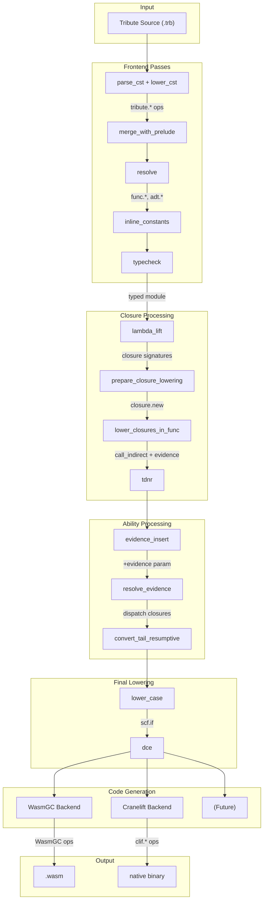

# Tribute Ability Implementation

> 이 문서는 Tribute의 ability 시스템 구현 전략을 정의한다.

## Design Decisions

### 결정 사항 요약

| 항목 | 선택 | 대안 (채택하지 않음) |
| ---- | ---- | -------------------- |
| 의미론 | 동적 (호출 시점 핸들러) | 정적 (생성 시점 캡처) |
| 핸들러 디스패치 | Evidence passing | 런타임 스택 탐색 |
| Continuation | One-shot, scoped | Multi-shot |
| Polymorphic 함수 | Evidence 전달 | Monomorphization, 전면 CPS |
| Evidence 구조 | 포인터 전달 + 정렬된 slice | bitmap, HashMap, 연결 리스트 |
| GC (Cranelift) | Boehm GC (초기) | Custom tracing GC |
| GC (WasmGC) | 런타임 내장 GC | - |

---

## TrunkIR Validation Responsibilities

TrunkIR validation follows the layered model in `new-plans/ir.md`:

- Local operation constraints belong in operation verifiers. They cover one
  operation's operands, results, attributes, regions, and terminator shape
  without relying on pipeline phase state.
- Lowering boundaries belong in `ConversionTarget`. Use partial conversion for
  intermediate rewrites that may leave unknown operations, and full conversion
  for named backend-ready or stage-complete boundaries.
- Whole-IR consistency belongs in pass-manager verifiers. Install these through
  `PassManager::with_verifier` when a pass sequence should report the pass that
  broke a graph-wide invariant such as SSA use-chain consistency.
- Shared behavior belongs in operation interfaces such as `PureOps` and
  `IsolatedFromAboveOps`. Add new interfaces only when there is an immediate
  generic consumer, not as a speculative hierarchy.

Do not add a separate semantic-contract DSL unless these existing mechanisms
cannot express a required invariant.

---

## Nominal Type Identity

The resolved AST stores a declaration-backed identity on every named type.
Source declarations derive that identity from their declaration node and carry
it through annotation conversion, type checking, substitution, TDNR receiver
matching, and AST-to-IR lowering. Reconstructing a named type from an
unqualified symbol alone is not sound.

TDNR annotation reconstruction uses the current module prefix: a qualified path
and a local unqualified reference must select the same declaration identity as
ordinary type resolution. Generic type collection and rewrite maps are keyed by
that identity rather than by display symbols.

Specialization mangling uses the declaration's qualified identity when needed
to distinguish same-spelled declarations. When the qualified identity equals
the existing display name, the ordinary mangle remains unchanged.

---

## Opaque Persistent Lists

`List(a)` uses a compiler-owned nominal type identity. Named type equality and
unification compare resolved declaration identity as well as type arguments;
the spelling `List` alone never selects the builtin. A source declaration with
the same short name may shadow ordinary annotation lookup, but it remains a
different nominal type and cannot capture list literal or list-pattern syntax.

The frontend lowers literals and patterns to the shared `list.*` dialect:

```text
list.empty<a>
list.prepend<a>(element, tail)
list.is_empty<a>(list)
list.head<a>(list)
list.tail<a>(list)
```

The dialect is representation-independent. In particular, shared IR contains no
`Empty`/`Cons` `adt.variant_new`, target field offsets, or allocation sizes.
Literal lowering evaluates source elements into SSA values from left to right
exactly once, then constructs the sequence from the last value back to the
first. Pattern lowering uses empty/head/tail sequence views for empty,
exact-length, and prefix-rest matching.

The prelude declares `List::prepend(value, tail)` as the minimal public dynamic
construction API. Its source wrapper delegates to a private compiler intrinsic,
and the shared pipeline replaces only that private ABI-marked call with
`list.prepend`. An ordinary source function with the same public qualified name
is not an intrinsic. User code depends only on the public function signature and
canonical `List(a)` contract; the private intrinsic, shared operation, and native
node layout are not separately addressable collection APIs.

For M1, native may lower the operations to private immutable singly linked
RC-managed nodes with empty represented by a private null sentinel. Each
non-empty node owns its element when reference-typed and its tail. Existing RTTI,
RC insertion, deep release, and borrowed-field rules apply after the private
node operations become native ADT/load/store operations. Returning or binding a
tail must keep it alive independently of the original list. Mutation based on a
uniqueness proof is an optional optimization and cannot change semantics.

WasmGC selects its own private GC layout. Native layout choices are not shared
IR conventions and do not establish Wasm execution parity. Full RRB trees,
efficient concatenation, slicing, and transients remain post-M1 work.

---

## Semantic Model

### 동적 의미론

클로저의 ability는 **호출 시점**에 해소된다:

```rust
fn make_counter() ->{State(Int)} fn() ->{State(Int)} Int {
    fn() {
        let n = State::get()
        State::set(n + 1)
        n
    }
}

// 사용
let counter = run_state(fn() make_counter(), 0)
// counter: fn() ->{State(Int)} Int

// 다른 State 핸들러 아래에서 호출
run_state(fn() {
    counter()  // 이 시점의 State 핸들러 사용
    counter()
}, 100)
```

클로저 타입에 `->{State(Int)}`가 명시되어 있으므로, 호출하는 쪽에서
State 핸들러를 제공해야 한다. 이는 일반 함수 호출과 동일한 계약이다.

### Scoped Resumption

Continuation은 자신을 캡처한 handler 스코프 내에서만 resume될 수 있다:

```rust
fn run_state(comp: fn() ->{e, State(s)} a, init: s) ->{e} a {
    handle comp() {
        do result { result }
        op State::get() { run_state(fn() resume state, state) }
    }
}
```

`resume`은 키워드이므로 단독으로 값이 될 수 없고, 호출 위치(`resume expr`)에서만
사용할 수 있다. 다만 `fn() resume state`처럼 람다 안에서 호출하는 것은 가능하며,
이 경우 continuation의 affine 사용(최대 1회 호출)은 런타임에서 보장해야 한다.

---

## Evidence Passing

### 설계 원칙

Evidence는 **포인터로 전달**한다. 함수 호출마다 8B 포인터 하나만 전달:

```rust
// 모든 effectful 함수는 Evidence 포인터를 받음
fn foo(ev: *const Evidence) -> a { ... }
```

- 대부분의 호출: 같은 포인터를 그대로 전달
- Handler 설치 시에만: 새 Evidence 할당 (GC 관리)

### Evidence 구조

Evidence는 힙에 할당되고 GC가 관리한다. 정렬된 Marker 배열로 단순하게 구현하며,
별도의 opaque 타입 대신 기존 ADT 시스템(struct/array)을 재사용한다:

```rust
// Evidence: 정렬된 Marker 배열 (ability_id 기준, 고정 크기)
type Evidence = Array(Marker)

// Marker: 각 ability에 대한 handler 정보
struct Marker {
    ability_id: i32,      // ability 식별자 (컴파일 타임 결정)
    prompt_tag: i32,      // 런타임 prompt 식별자
    tr_dispatch_fn: ptr,  // fn operation용 tail-resumptive dispatch closure
    handler_dispatch: ptr // op operation용 CPS handler dispatch closure
}
```

**설계 결정:**

- `ability_id`와 `prompt_tag`는 `i32`로 통일한다.
- dispatch field는 target별 closure/function reference 표현으로 lowering한다.
  Native marker는 closure pointer를 저장하고, WasmGC marker는
  `(table_idx: i32, env: anyref)` closure struct reference를 `anyref`로 저장한다.
- 별도의 opaque 타입(`ability.evidence_ptr`, `ability.marker`) 대신 struct/array 사용
- 기존 `adt.array_get`, `adt.struct_get` 연산 재사용 가능
- Markers는 ability_id 기준 정렬 → binary search 가능 O(log n)
- 배열은 고정 크기: `evidence_extend`는 새 배열을 할당하여 반환

### Handler Dispatch Closures

Operation table 대신 handler boundary에서 두 종류의 dispatch closure를 만든다:

- `tr_dispatch_fn`: `fn` operation 전용. `(op_idx, value) -> anyref`
- `handler_dispatch`: `op` operation 전용. `(k, op_idx, value) -> anyref`

`op_idx`는 ability 이름과 operation 이름의 stable hash로 계산한다. 호출 지점과
handler dispatch closure가 같은 hash 함수를 사용하므로, handler arm 등록 순서에
의존하지 않는다.

### 조회

Evidence에서 marker를 찾는 것은 런타임 함수 + ADT 연산의 조합으로 구현:

```rust
// ability operation 호출 시
// Marker 필드 순서는 tribute-ir ability::MarkerField가 단일 정의다.
let marker = evidence_lookup(ev, STATE_ID)  // high-level IR: Marker 반환
let tag = adt.struct_get(marker, MarkerField::PromptTag)
let handler = adt.struct_get(marker, MarkerField::HandlerDispatch)
func.call_indirect(handler, ...)
```

Shared lowering은 concrete marker 접근을 직접 만들지 않고 `effect.*` ABI
operation을 생성한다. Native lowering에서는 이를 `__tribute_evidence_*` C ABI와
native closure pointer 호출로 대체한다. Wasm lowering은 같은 ability id와 marker
field 순서를 사용해 binary search helper를 생성하고, marker에 저장된 `anyref`
closure를 `(table_idx, env)`로 풀어 `wasm.call_indirect`를 emit한다.

### Handler 설치

Handler 설치 시 `evidence_extend` 런타임 함수로 새 Evidence를 생성:

```rust
fn run_state(comp: fn(Evidence) -> a, init: s, ev: Evidence) -> a {
    let tag = fresh_prompt()
    let marker = Marker {
        ability_id: STATE_ID,
        prompt_tag: tag,
        tr_dispatch_fn: state_tr_dispatch,
        handler_dispatch: state_handler_dispatch,
    }

    // evidence_extend: 정렬 유지하며 marker 삽입, 새 배열 반환
    let new_ev = evidence_extend(ev, marker)

    push_prompt(tag, || comp(new_ev))
}
```

### Ability Operation

```rust
fn state_get(ev: Evidence) -> s {
    let marker = evidence_lookup(ev, STATE_ID)
    let tag = adt.struct_get(marker, MarkerField::PromptTag)
    let handler = adt.struct_get(marker, MarkerField::HandlerDispatch)
    let op_idx = hash(State, get)
    handler(k, op_idx, Nil)
}
```

### 시나리오별 동작

| 상황 | 동작 | 비용 |
| ---- | ---- | ---- |
| 일반 함수 호출 | 같은 배열 참조 전달 | 4B (WASM) / 8B (native) |
| Handler 설치 | 새 Evidence 배열 할당 | GC alloc + O(n) 복사 |
| Operation 조회 | Binary search | O(log n) |

**대부분의 호출에서 Evidence는 변경되지 않으므로**, 참조만 전달하면 충분하다.

### 향후 최적화 가능성

- 스레딩 모델이 정해지면 append-only 버퍼 공유 방식 검토
- 핫 패스에서 자주 쓰이는 ability는 전용 레지스터 할당 고려

### Evidence 전달 규칙

1. **Direct 함수**는 evidence를 전달받지 않는다. 명시적인 닫힌 빈 row `->{}`는
   Direct다. Effect annotation을 생략한 `fn(a) -> b`의 semantic type은
   `fn(a) ->{e} b`이지만, 정의에서 발견된 concrete residual effect가 없다면
   worker 자체도 Direct일 수 있다
2. **EvidenceDirect 함수**는 evidence를 받지만 `done_k` 없이 source result를 직접 반환한다
3. **CPS 함수**는 evidence와 `done_k`를 받고 source result를 직접 반환하지 않는다
4. **Handler 설치** 시 새 evidence를 할당한다
5. **Handled ability operation** 시 evidence에서 marker를 조회한다

호출 규약은 effect requirement의 상한으로 합성한다:

```text
Direct < EvidenceDirect < Cps
```

Compiler-owned ambient ability `std::io::Io`만 요구하는 함수는 현재
`EvidenceDirect`다. `Io`는 operation dispatch를 위해 전달된 evidence를 lookup하지
않는다. Evidence의 concrete representation은 source semantics가 아니라 backend
구현 세부사항이다.
`Io`와 `Throw(std::io::Error)`가 함께 있으면 `Throw` 때문에 `Cps`로 승격된다.
자세한 표준 I/O 계약은 [io.md](io.md)를 따른다.

기본 I/O의 embedded `std::io` source wrapper는 target ABI를 직접 호출하지 않는다.
Frontend shared lowering은 private intrinsic stub을 `tribute_io.write`와
`tribute_io.read_line` operation으로 바꾼다. 이 boundary는 rope 표현 대신 `Bytes`와
target-independent `ReadLineResult`를 사용한다. Native와 Wasm pipeline은 이후 각자의
runtime ABI 또는 host import로 operation을 완전히 lower해야 한다.

논리적인 CPS ABI에서 함수와 `done_k`의 control result는 `Never`다:

```text
fn cps(ev: Evidence, done_k: fn(T) -> Never, args...) -> Never
```

현재 IR은 true tail call이 모든 경로에서 보장되지 않으므로 continuation chain의
행정적 반환값을 `anyref`로 전달하는 compatibility representation을 사용한다.
`anyref`는 source result가 아니며 `Cps` convention의 영구적인 의미도 아니다.
Control lowering이 분리되면 true tail-call backend는 `Never`, trampoline
backend는 `Step`, 기존 경로는 `anyref` carrier를 선택할 수 있다.

### 런타임 함수

Evidence 조작을 위한 런타임 함수들:

| 함수 | 시그니처 (WASM) | 설명 |
| ---- | -------------- | ---- |
| `evidence_lookup` | `(ev: i32, ability_id: i32) -> i32` | Binary search로 marker 인덱스 반환 |
| `evidence_extend` | `(ev: i32, marker: i32) -> i32` | 정렬 유지하며 새 배열 반환 |

**설계 결정:**

- `marker_prompt`, `marker_op_table` 함수는 제거 → `adt.struct_get`으로 대체
- `ability_id`는 `i32`로 단순화 (8비트 제한 불필요, 실제 ability 수는 적음)
- WASM에서 모든 참조 타입은 i32 인덱스로 표현

### 변환 예시

```rust
// 원본
fn fetch_all(urls: List(Text)) ->{Http, Async} List(Response) {
    urls.map(fn(url) url.get.await)
}

// 변환 후 (개념적)
fn fetch_all(urls: List(Text), ev: Evidence) -> List(Response) {
    urls.map(
        fn(url, ev_inner) {
            let response = http_get(url, ev_inner)
            async_await(response, ev_inner)
        },
        ev
    )
}
```

---

## Selective Transformation

### Effect Row Granularity and Convention Bound

Source effect row는 operation 집합이 아니라 **ability identity의 집합**을
기록한다. Semantic function type의 calling convention은 row에 들어 있는 각
ability가 요구하는 convention의 상한으로 결정한다.

```text
requirement({A₁, ..., Aₙ | e})
  = requirement(A₁) ⊔ ... ⊔ requirement(Aₙ) ⊔ requirement(e)

closed empty row `->{}`    → Direct
fn-only or empty ability    → EvidenceDirect
ability containing any op  → Cps
open or otherwise unknown e → Cps
```

Effect annotation 생략은 closed-empty 추론이 아니다.

```text
fn(a) -> b ≡ fn(a) ->{e} b
```

따라서 이 타입을 통한 **간접 호출**은 열린 `e` 때문에 `Cps`다. 반면 named
definition의 physical worker convention은 semantic function type과 별도로 기록한다.
생략된 annotation으로부터 생긴 generalized tail은 worker requirement에 포함하지
않고, body에서 발견된 concrete residual abilities의 상한만 사용한다. 그러므로
effect-polymorphic `add`는 Direct worker를 가질 수 있으며, first-class function
boundary에서는 contextual convention에 맞는 adapter를 사용한다. 명시적인 `->{}`도
닫힌 빈 row이므로 Direct를 사용한다.

여기서 `Cps`는 source result를 직접 반환하지 않고 `done_k`로 전달한다는
논리적 convention이다. 실제 lowered result carrier는 control-lowering 전략이
`Never`, `Step`, 또는 compatibility `anyref` 중에서 결정한다.

따라서 `fn`과 `op`를 함께 선언한 ability는 함수 ABI를 정할 때 `Cps`로
분류한다. 이는 안전한 **ability 단위 상한**이다. 다만 CPS 함수 안에서도 개별
`fn` operation 호출은 `tr_dispatch_fn`을 통한 evidence-direct fast path를
사용할 수 있다. 함수 표현을 결정하는 상한과 operation call-site의 dispatch
최적화는 서로 다른 결정이다.

Operation 종류를 source effect row에 기록하는 대안은 채택하지 않는다. 예를 들어
`{State::get}`과 `{State::get, State::set}`을 서로 다른 effect로 만들면 이 차이가
함수 타입, effect polymorphism, subtyping, 간접 호출 및 별도 컴파일 단위의 ABI에
모두 관여해야 한다. 내부 calling-convention 정보로만 operation 집합을 추적하면
간접 호출에서 실제 callee가 더 강한 convention을 요구할 수 있으므로 sound하지 않다.

#### 다른 언어와의 비교

- **Koka**는 effect label 단위의 row를 사용하고, selective CPS 판정을 row의 각
  label이 요구하는 변환의 join으로 계산한다. 열린 effect variable은 보수적으로
  CPS가 필요하다고 판정한다. 최신 Koka의 `fun` operation과 linear effect는
  tail-resumptive 호출을 evidence lookup 뒤 직접 실행하여 일반 control 변환을
  피한다. Tribute의 ability 단위 상한과 `fn` fast path에 가장 가까운 선례다.
  ([Type Directed Compilation of Row-Typed Algebraic Effects](https://www.microsoft.com/en-us/research/wp-content/uploads/2016/12/algeff.pdf),
  [Koka Language Book](https://koka-lang.github.io/koka/doc/book.html),
  [Generalized Evidence Passing for Effect Handlers](https://xnning.github.io/papers/multip-tr.pdf))
- **Eff**는 computation type의 dirt에 호출 가능한 operation 집합을 기록한다.
  이 정밀도는 effect subtyping, 집합 포함 관계를 나타내는 coercion, elaboration과
  함께 타입 시스템의 일부가 된다. 이는 operation 단위 설계가 가능함을 보여 주지만,
  단순한 ABI 분석 속성으로 추가할 수 있는 기능은 아님을 보여 주는 대안이다.
  ([Eff handlers tutorial](https://www.eff-lang.org/handlers-tutorial.pdf),
  [Explicit Effect Subtyping](https://arxiv.org/abs/2005.13814))
- **Unison**은 함수 타입에 ability 집합을 기록한다. Handler는 ability request의
  operation별로 match하고 각 branch에서 continuation을 받으므로, ability-level
  effect typing의 선례이지만 Tribute의 정적인 `fn`/`op` 구분에는 대응하지 않는다.
  ([Abilities and ability handlers](https://www.unison-lang.org/docs/language-reference/abilities-and-ability-handlers/),
  [Writing your own abilities](https://www.unison-lang.org/docs/fundamentals/abilities/writing-abilities/))
- **Effekt**는 effect를 computation이 요구하는 capability로 해석하고 explicit
  capability passing으로 내린다. Second-class block과 contextual effect
  polymorphism을 사용하므로 Tribute의 first-class function ABI와 직접 같지는 않지만,
  effect 정보를 capability-passing representation으로 lowering하는 비교 사례다.
  ([Effects as Capabilities](https://ps.informatik.uni-tuebingen.de/publications/brachthaeuser20effekt/))

이 비교에 따라 source effect row의 ability 단위 표현은 유지한다. Operation 단위
정밀도가 실제로 필요해지면 숨은 최적화 메타데이터가 아니라 타입 시스템 기능으로
별도 설계해야 한다. 열린 row의 간접 호출은 보수적인 `Cps`를 유지하되, named
definition에는 semantic type과 분리된 worker convention을 사용한다. 추가적인
plain/CPS worker 복제나 specialization은 후속 최적화로 검토한다.

### 변환 범위

모든 코드를 CPS로 변환하지 않는다. Ability operation 지점에서만 continuation 캡처가 필요하다:

```text
생략 annotation의 semantic type       → open row, indirect call은 Cps
concrete residual effect 없는 worker  → Direct
명시적 빈 effect (fn(a) ->{} b)      → Direct
Ambient/fn effect                    → EvidenceDirect
General op/Throw effect              → Cps, effect point만 continuation 처리
```

### Ability Polymorphism 처리

```rust
fn map(xs: List(a), f: fn(a) ->{e} b) ->{e} List(b)
```

`f`가 순수인지 effectful인지 컴파일 타임에 모를 수 있다. 전략:

1. **열린 row는 Cps**: 구체화 전에는 더 강한 convention을 요구할 가능성을
   배제할 수 없으므로 `done_k`를 포함하는 ABI를 사용한다
2. **Evidence는 항상 전달**: effectful polymorphic 호출은 동일한 evidence를 전달한다
3. **Tail-resumptive 최적화**: 구체적인 `fn` operation call-site에서는 실제 shift가
   필요 없다
4. **Inlining/specialization**: row가 구체화되면 더 약한 convention의 worker로
   최적화할 수 있다

### Tail-Resumptive Optimization

두 가지 레벨에서 tail-resumptive 최적화가 적용된다:

#### 1. 선언 수준 보장 (`fn` operation)

`fn`으로 선언된 operation은 **호출 지점에서** continuation 캡처 코드를
생성하지 않는다. Evidence에서 handler 함수를 조회하여 직접 호출한다:

```rust
// fn operation 호출 → shift 없이 직접 호출
fn logger_log(msg: String, ev: Evidence) -> Nil {
    let marker = evidence_lookup(ev, LOGGER_ID)
    let tr_dispatch = adt.struct_get(marker, MarkerField::TrDispatchFn)
    let op_idx = hash(Logger, log)
    tr_dispatch(op_idx, msg)  // 직접 호출, shift 없음
}
```

Reader, Logger 등 대부분의 실용적 ability가 `fn`으로 선언되므로,
이 최적화가 큰 효과를 낸다.

`Io` 함수도 continuation을 받지 않는다는 점에서는 `fn` operation과 같지만,
handler dispatch가 없으므로 marker lookup도 수행하지 않는다. 현재는 ABI 안정성과
effectful call 규칙의 단순성을 위해 evidence를 계속 전달한다. 현재 representation의
`Io`-only entrypoint는 empty evidence를 사용할 수 있지만 이는 backend 구현
세부사항이다.

#### 2. Handler 수준 분석 (`op` operation)

`op`로 선언된 operation이라도, 특정 handler가 `resume`을 항상 tail position에서
1회 호출하면 컴파일러가 감지하여 최적화할 수 있다:

```rust
// 원본: 재귀적 handler 재설치
op State::get() { run_state(fn() resume state, state) }
op State::set(v) { run_state(fn() resume Nil, v) }

// 컴파일러 변환 (개념적): 루프 + mutable state
fn run_state_optimized(comp, init_state) {
    var state = init_state              // 컴파일러 내부 mutable
    loop {
        match next_suspended_op {
            Done(result) -> return result
            Get(resume) -> resume(state)        // shift 없이 직접 반환
            Set(v, resume) -> {
                state = v
                resume(Nil)
            }
        }
    }
}
```

이 분석은 best-effort이며, 복잡한 handler에서는 적용되지 않을 수 있다.

#### `op -> Never` 최적화

`-> Never`를 반환하는 operation은 continuation을 캡처하지 않는다.
Handler arm에서도 `-> k`를 사용하지 않으므로 continuation 관련 오버헤드가 없다.

---

## Prompt and Continuation

### Prompt의 역할

중첩된 handler에서 올바른 경계를 찾기 위해 prompt가 필요하다:

```text
스택 (아래가 바닥)
─────────────────────
[State prompt: P1]     ← 바깥쪽 run_state
[Logger prompt: P2]    ← run_logger
[State prompt: P3]     ← 안쪽 run_state (같은 ability 중첩)
[현재 실행 지점]        ← State::get() 호출
─────────────────────
```

`State::get()`은 evidence에서 State marker를 조회하고, 해당 marker의
prompt(P3)까지만 continuation을 캡처한다.

### ability_id와 prompt_tag의 관계

Evidence 기반 디스패치에서 두 가지 핵심 식별자가 협력한다:

| 식별자 | 역할 | 결정 시점 | 범위 |
| ------ | ---- | --------- | ---- |
| `ability_id` | 어떤 ability인지 식별 | 컴파일 타임 | 프로그램 전역 (i32) |
| `prompt_tag` | 어떤 handler 인스턴스인지 식별 | 런타임 | 동적으로 생성 |

**N:N 관계:**

- **같은 ability 중첩**: ability_id 동일, prompt_tag 상이
- **한 handle에서 여러 ability 처리**: ability_id 상이, prompt_tag 동일

```rust
// 같은 ability를 중첩하는 예시
fn nested_state_example() -> Int {
    handle {                             // prompt_tag = P1
        handle {                         // prompt_tag = P2
            State::get()                 // ability_id = STATE_ID
            // → evidence에서 STATE_ID로 조회하면 가장 안쪽(P2)의 marker 반환
        } {
            op State::get() { resume 10 }
        }
    } {
        op State::get() { resume 20 }
    }
}
```

**조회 흐름:**

1. `State::get()` 호출
2. Evidence에서 `ability_id`(STATE_ID)로 marker 조회 → 가장 안쪽 handler의 marker 반환
3. 반환된 marker의 `prompt_tag`(P2)로 shift 수행
4. P2까지의 continuation만 캡처되어 inner handler로 전달

이 설계로 같은 ability를 중첩해도 각 handler가 자신의 영역만 처리할 수 있다.

### shift/reset 의미론

```rust
// reset: prompt 설치
push_prompt(tag, body)

// shift: continuation 캡처
shift(tag, fn(k) handler_body)
```

`shift(tag, f)`는:

1. 현재 지점부터 `tag`가 설치된 지점까지의 continuation을 `k`로 캡처
2. `f(k)`를 실행
3. `k`는 one-shot linear 타입 (한 번만 사용 또는 명시적 drop)

### `resume` 규칙

`op -> T` handler body에서 `resume`은 최대 1회 호출할 수 있다 (affine).
호출하지 않으면 continuation은 암묵적으로 drop된다:

```rust
op State::get() { resume current_state }    // 1회: 정상 resume
op SomeOp::cancel() { fallback_value }      // 0회: 암묵적 drop
```

항상 resume하지 않는 operation은 `-> Never`로 선언한다.
`-> Never`는 continuation 캡처 자체를 생략하는 최적화를 가능하게 한다.
`op -> Never` handler body에서는 `resume`을 사용할 수 없다.

---

## Target-Specific Implementation

### WasmGC

WasmGC는 당분간 후순위 타겟이지만, active path는 native와 같은 shared
middle-end의 tail-call CPS / effect ABI 결과를 입력으로 받는다. 과거 설계의
yield bubbling / `YieldResult` trampoline 방식은 active path가 아니다.

Wasm lowering은 `effect.extend`, `effect.dispatch_tail`,
`effect.dispatch_cps`를 evidence helper, closure unpacking, and
`wasm.call_indirect`로 낮춘다. 남아 있는 `Step`, `Continuation`,
`ResumeWrapper` builtin 타입은 과거 trampoline 경로의 호환 흔적이며, 새 effect
ABI lowering의 의미론적 기준이 아니다.

### WASM / Native 공통: CPS Tail-Call Effect Handling

Effect handling은 tail-call CPS 방식으로 처리된다.
`lower_ability_perform`이 `ability.perform`과 `ability.call`을 target-independent
`effect.dispatch_cps` / `effect.dispatch_tail` ABI operation으로 변환한다.
`resolve_evidence`는 handler 설치를 `effect.extend`로 표현한다.
`lower_handle_dispatch`는 runtime dispatch loop가 아니라 body result에 `done`
handler를 적용하는 정리 pass이다. Backend-specific lowering이 이후 `effect.*`를
native runtime call 또는 Wasm evidence helper와 indirect call로 제거한다.

상세 내용은 [cps-effects.md](cps-effects.md)를 참조.

**파이프라인 분기:**

```text
공통: parse → resolve → typecheck → tdnr → ast_to_ir
      → evidence_params → prepare_closure_lowering → lower_closures_in_func
      → lower_ability_perform → resolve_evidence → lower_handle_dispatch
      → dce → resolve_casts

WASM:   → lower_to_wasm [includes evidence_to_wasm] → emit_wasm
Native: → evidence_to_native → lower_to_clif → emit_native
```

---

## Memory Management

### WasmGC

런타임의 GC가 자동으로 처리한다. 다만 현재 주요 구현 경로는 native이며,
WasmGC continuation/trampoline 객체 설계는 active path가 아니다.

### Cranelift: Reference Counting

Cranelift 타겟에서는 **Reference Counting**을 채택한다.

#### RC 전략: +1 convention

- 생산자가 소유 (refcount = 1로 할당)
- 소비자가 retain (+1)
- 마지막 사용에서 release (-1, 0이면 해제)

**Object 헤더:**

```text
[-8 bytes] refcount: u32 + type_id: u32
[ 0 bytes] first field (자연 정렬)
```

**RC 삽입 pass** (`tribute-passes/src/native/rc.rs`):

- 함수 파라미터: retain 삽입
- 함수 반환: 소유권 이전 (retain/release 없음)
- 로컬 변수: 마지막 사용에서 release
- 필드 접근: retain/release 쌍

**Continuation과 RC:**

- Yield bubbling에서 continuation은 ADT struct로 캡처됨
- 캡처된 라이브 변수들은 struct 필드로 저장되어 RC가 자동 관리
- Resume 시 struct에서 필드를 꺼내 복원

**단계적 구현:**

1. Phase 2: malloc/free 단순 할당 (누수 허용)
2. Phase 3: RC retain/release 삽입
3. Future: Cycle detection (필요시)

---

## Compilation Pipeline

### 아키텍처 원칙

Tribute 컴파일러 파이프라인은 다음 원칙을 따른다:

1. **순수 변환 (Pure Transformations)**: 각 패스는 `Module → Module` 순수 함수로 구현
2. **중앙 오케스트레이션**: 패스 연결은 `pipeline.rs`에서 관리
3. **선택적 캐싱**: 비용이 큰 패스만 `#[salsa::tracked]`로 캐싱
4. **관심사 분리**: 패스 구현과 파이프라인 조합을 분리

Prelude가 정의하는 well-known type은 type checking 결과의 별도 metadata로
보존한다. 최소 metadata 집합인 `WellKnownTypes`는 prelude `String`의 semantic
type과 stable declaration identity를 `TypedModule` 경계까지 전달하고,
AST-to-IR lowering은 declaration identity를 직접 비교해 이를 정확한
TrunkIR `TypeRef`로 변환해 root module의 `tribute.type.string` attribute에
기록한다. Native/Wasm constant lowering은 이 attribute만 사용하며 이름이나
layout scan으로 복구하지 않는다. Textual IR에서 attribute가 유실된 경우
string constant lowering은 보수적으로 실패한다.

```rust
// 패스 구현 (tribute-passes): 순수 변환만 담당
pub fn typecheck(db: &dyn Database, module: Module) -> Module { ... }
pub fn lambda_lift(db: &dyn Database, module: Module) -> Module { ... }

// 파이프라인 (src/pipeline.rs): 오케스트레이션만 담당
pub fn compile(db, source: SourceCst) -> Module {
    let module = parse_and_lower(db, source);
    let module = resolve(db, module);
    let module = typecheck(db, module);
    let module = lambda_lift(db, module);
    // ...
}
```

### 파이프라인 구조


```mermaid
flowchart TB
    subgraph input["Input"]
        source["Tribute Source (.trb)"]
    end

    subgraph frontend["Frontend Passes"]
        parse["parse_cst + lower_cst"]
        prelude["merge_with_prelude"]
        resolve["resolve"]
        const_inline["inline_constants"]
        typecheck["typecheck"]
    end

    subgraph closure["Closure Processing"]
        lambda_lift["lambda_lift"]
        closure_prep["prepare_closure_lowering"]
        closure_func["lower_closures_in_func"]
        tdnr["tdnr"]
    end

    subgraph ability["Ability Processing"]
        evidence["evidence_insert"]
        resolve_ev["resolve_evidence"]
        tail_opt["convert_tail_resumptive"]
    end

    subgraph lowering["Final Lowering"]
        lower_case["lower_case"]
        dce["dce"]
    end

    subgraph backends["Code Generation"]
        wasm["WasmGC Backend"]
        cranelift["Cranelift Backend"]
        future["(Future)"]
    end

    subgraph output["Output"]
        wasm_bin[".wasm"]
        native["native binary"]
    end

    source --> parse
    parse -->|"tribute.* ops"| prelude
    prelude --> resolve
    resolve -->|"func.*, adt.*"| const_inline
    const_inline --> typecheck
    typecheck -->|"typed module"| lambda_lift
    lambda_lift -->|"closure signatures"| closure_prep
    closure_prep -->|"closure.new"| closure_func
    closure_func -->|"call_indirect + evidence"| tdnr
    tdnr --> evidence
    evidence -->|"+evidence param"| resolve_ev
    resolve_ev -->|"dispatch closures"| tail_opt
    tail_opt --> lower_case
    lower_case -->|"scf.if"| dce
    dce --> wasm & cranelift & future
    wasm -->|"WasmGC ops"| wasm_bin
    cranelift -->|"clif.* ops"| native
```

### 패스 분류

| 카테고리 | 패스 | 입력 | 출력 | 캐싱 |
| -------- | ---- | ---- | ---- | ---- |
| **Frontend** | `resolve` | tribute.* ops | func.*, adt.* | ✓ |
| | `inline_constants` | const refs | inlined values | |
| | `typecheck` | type.var | solved or generalized typed AST | ✓ |
| **Closure** | `lambda_lift` | lambdas | top-level funcs | |
| | `prepare_closure_lowering` | core.func params | closure signatures | module-wide |
| | `lower_closures_in_func` | closure.new | func.call_indirect + evidence arg | function-anchored |
| | `tdnr` | x.method() | Type::method(x) | |
| **Ability** | `ast_to_ir evidence params` | effectful funcs | +ev param | |
| | `lower_ability_perform`, `tail_resumptive` | ability.perform/call | effect.dispatch_* | function-anchored |
| | `resolve_evidence` | handler evidence setup | effect.extend | module-wide setup before function-local lowering |
| | `lower_handle_dispatch` | ability.handle_dispatch | final handler result | function-anchored |
| **Backend effect ABI** | `native/evidence runtime decls` | evidence runtime stubs | native extern declarations | module-wide |
| | `native/evidence` | effect.* | native runtime calls + call_indirect | function-anchored |
| | `wasm/evidence runtime funcs` | evidence runtime stubs | wasm evidence helpers | module-wide |
| | `wasm/evidence_to_wasm` | effect.* | wasm.call + wasm.call_indirect | function-anchored |
| **Lowering** | `ast_to_ir case lowering` | tribute.case | scf.if | frontend lowering, not a pass |
| | `canonicalize`, local `dce`, `scf_to_cf` | func.func body | canonical body / cf blocks | function-anchored |
| | `global_dce` | module symbols | reachable funcs | module-wide |

`ast_to_ir case lowering` is listed as a pipeline stage for design clarity, but
it is part of frontend IR construction rather than a standalone pass. The
function-anchored lowering point after case construction is `scf_to_cf_pass()`,
which runs under `PassManager::nest::<func.func>()`.

`typecheck` solves function-local unification variables where constraints make
them concrete and generalizes remaining polymorphic variables into stable
`BoundVar` indices. Generalization covers the function signature, checked body,
and post-solve deferred UFCS callee types so later TDNR and monomorphization do
not see raw solver variables in typed references. Each type-scheme
instantiation freshens both bound type variables and quantified effect-row variables,
while preserving repeated references to the same row variable within that
single instantiation.

Local scopes store `TypeScheme` bindings. At each `let`, the checker solves the
constraint prefix through that binding and separately tracks the effect of
evaluating the right-hand side. A closed-pure evaluation generalizes type and
effect-row variables not free in the surrounding local environment; an
effectful evaluation stores a monomorphic scheme. Latent effects inside a
lambda's function type do not make evaluation of the lambda effectful.

Constraints produced from calls, lambdas, and handler boundaries retain their
source origin through solving. User-facing failures render effect rows in
canonical source syntax, hide internal row-variable identities, and attach the
primary diagnostic to the originating expression with the enclosing effect
contract as secondary context. A frontend error stops the pipeline before AST
to IR conversion and shared lowering so invalid source does not produce
cascading diagnostics containing internal IR operation identities.

Effect-annotation conversion also preserves the source origin of each concrete
effect separately from the semantic `EffectRow`. Duplicate annotations are
diagnosed at the repeated annotation after solving, with the first matching
annotation attached as secondary context; parameterized and qualified effects
keep the origin recorded at their shared annotation-to-row conversion point.

### 점진적 개선 방향: Fine-Grained Queries

현재 구조는 모듈 단위(coarse-grained) 처리를 한다. 장기적으로
rust-analyzer 스타일의 fine-grained 쿼리 기반 아키텍처로 발전을 고려한다.

#### 현재 (Coarse-Grained)

```rust
// 모듈 전체를 처리
fn typecheck(db, module: Module) -> Module
fn resolve(db, module: Module) -> Module
```

#### 목표 (Fine-Grained, rust-analyzer 스타일)

```rust
// 개별 항목 단위로 쿼리
fn type_of_function(db, func_id: FunctionId) -> Type
fn body_of_function(db, func_id: FunctionId) -> Body
fn signature_of_function(db, func_id: FunctionId) -> Signature
fn infer_function(db, func_id: FunctionId) -> InferenceResult

// 의존성 기반 재계산
// 함수 A 수정 시 → A의 body만 재파싱
//                → A를 호출하는 함수들만 재검사
```

#### rust-analyzer 아키텍처 참고점

- `base_db`: 입력 쿼리 (파일 내용, 크레이트 그래프)
- `hir_def`: 정의 추출 (함수, 타입, 모듈 구조)
- `hir_ty`: 타입 추론 및 검사
- ItemTree: 함수 본문 변경에 영향받지 않는 요약 구조

**전환 시 고려사항:**

- `FunctionId`, `TypeId` 등 안정적인 ID 체계 필요
- 모듈 구조와 개별 항목 분리
- 점진적 마이그레이션 전략 (일부 패스부터 적용)

이를 통해 "함수 하나 수정 시 해당 함수만 재처리"하는 진정한 incremental compilation이 가능해진다.

---

## Type System for Evidence

### Evidence 타입

런타임 수준에서 Evidence는 단순한 `Array(Marker)`이다:

```rust
type Evidence = Array(Marker)

struct Marker {
    ability_id: i32,
    prompt_tag: i32,
    tr_dispatch_fn: ptr,
    handler_dispatch: ptr,
}
```

위 `ptr` 표기는 high-level/native 설명이다. WasmGC의 concrete `_Marker` GC type은
같은 field order를 유지하되 dispatch closure field를 `anyref` closure reference로
저장한다.

타입 시스템 수준에서는 ability row에 대해 parameterized된다:

```text
fn foo() ->{State(Int), Logger} Nil

// 타입 검사 시 Evidence가 포함해야 할 ability:
Evidence({State(Int), Logger | ρ})
```

Row polymorphism으로 ability 합성을 표현하되, 런타임 표현은 단순 배열이다.

### Evidence 조작

```rust
// Evidence 확장 (런타임 함수)
evidence_extend(ev, marker) : Evidence → Evidence

// Evidence 조회 (런타임 함수 + ADT 연산)
let idx = evidence_lookup(ev, ability_id)  // 런타임: binary search
let marker = adt.array_get(ev, idx)        // ADT 연산
```

### Canonical Ordering

각 ability에 전역적인 ID (i32)를 부여한다:

```text
State    → 0
Logger   → 1
Http     → 2
Async    → 3
...
```

Evidence 배열은 ability_id 기준으로 정렬된다. `evidence_lookup`이 binary search로 O(log n) 탐색:

```rust
// {Logger, State} 든 {State, Logger} 이든
// markers 배열은 항상 [State(id=0), Logger(id=1)] 순서
let idx = evidence_lookup(ev, STATE_ID)  // binary search
```

**설계 결정:**

- Ability ID: `i32` (실용적인 ability 개수는 수십 개 수준)
- runtime dispatch가 필요한 compiler/표준 라이브러리 ability (State, Http 등): 0-63 예약
- 사용자 정의 ability: 64+

`Io`의 canonical builtin identity는 frontend와 type system에서 ambient semantics를
판정하기 위한 identity다. 이것이 runtime `ability_id` 할당이나 특정 Evidence 배열
표현을 요구하지는 않는다. 보장되는 계약은 `Io`가 handler lookup이나 dispatch를
요구하지 않는다는 점뿐이다. 향후 runtime capability를 evidence에 저장할지는 backend
구현 선택으로 남긴다.

---

## Open Questions

1. **Tail-Resumptive 분석 범위**: 어디까지 분석할지?
   - 함수 내부만 vs 호출 그래프 전체

2. **디버깅 지원**: 스택 트레이스 복원
   - Source map 생성
   - Continuation 내부 프레임 표시

3. **User-defined Linear Types**: FFI 안전성을 위해 필요
   - 문법 설계
   - Continuation과의 상호작용

4. **Fine-Grained Query 아키텍처**: 장기적 incremental compilation 개선
   - rust-analyzer 스타일의 ID 기반 쿼리 시스템 도입 시점
   - 기존 Module 기반 패스와의 공존 전략
   - LSP 성능 요구사항에 따른 우선순위 결정

5. **Operation Identity와 Origin Tracking**

   Pass를 거치면서 변환된 operation 사이의 equivalence를 추적하는 방법:

   **현재 상태: Location 기반 추적**
   - 각 operation은 `location: Location` 필드로 소스 위치 보존
   - 모든 pass가 location을 잘 보존하고 있음:
     - `op.modify(db)`: 자동 보존
     - 새 operation 생성 시: `let location = op.location(db);` 패턴
     - Region/Block 재생성 시: 원본 location 복사
   - "같은 소스에서 유래한 operation"은 같은 location을 공유

   **고려했던 대안들**

   | 방식 | 장점 | 단점 |
   | ---- | ---- | ---- |
   | `OperationId` (BlockId와 유사) | 명시적 identity | 1:N 변환 시 대표 선택 필요 |
   | Fractional indexing (42.1.0) | 계층적 추적 가능 | ID 길이 폭발, N:1 여전히 문제 |
   | Origin tag (중복 허용) | 1:N 자연스럽게 해결 | Location과 기능 중복 |

   **결론**: 당장은 Location 기반으로 충분함
   - Source-level equivalence ("같은 소스에서 유래"): Location으로 해결
   - Fine-grained query (함수/타입 단위): top-level item의 Symbol로 식별
   - 별도 ID 시스템은 필요성이 구체화될 때 도입 검토

   **주의 사항**
   - Synthetic operation (helper function 등) 생성 시 의미 있는 location 부여 필요
   - Pass 추가 시 location 보존 패턴 준수 필요

---

## References

- [Generalized Evidence Passing for Effect Handlers][koka-evidence] (Koka)
- [Effect Handlers, Evidently][effect-evidently] (Scoped Resumption)
- [Do Be Do Be Do](https://arxiv.org/abs/1611.09259) (Frank, Unison의 기반)

[koka-evidence]: https://www.microsoft.com/en-us/research/publication/generalized-evidence-passing-for-effect-handlers-or-efficient-compilation-of-effect-handlers-to-c/
[effect-evidently]: https://dl.acm.org/doi/10.1145/3408981
