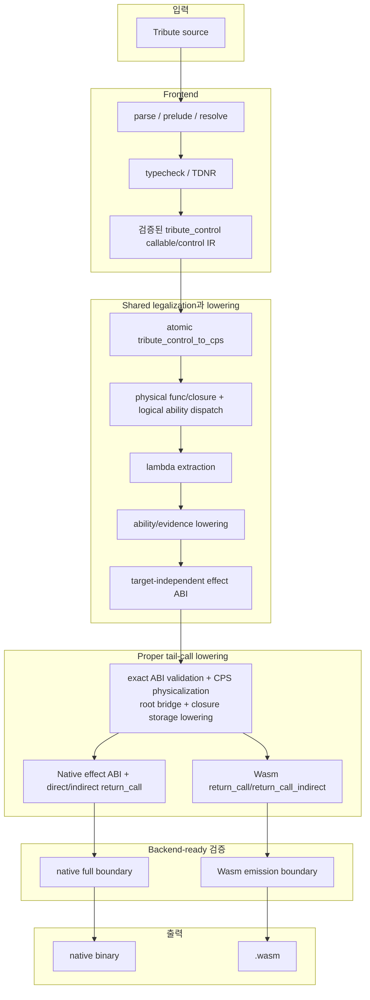

# Tribute Ability Implementation

> 이 문서는 Tribute의 ability 시스템 구현 전략을 정의한다.

## Design Decisions

### 결정 사항 요약

| 항목 | 선택 | 대안 (채택하지 않음) |
| ---- | ---- | -------------------- |
| 의미론 | 동적 (호출 시점 핸들러) | 정적 (생성 시점 캡처) |
| 핸들러 디스패치 | Evidence passing | 런타임 스택 탐색 |
| Continuation | One-shot, scoped | Multi-shot |
| Polymorphic 함수 | Monomorphization + 필요한 Evidence/CPS convention | Uniform erasure, dictionary passing |
| Evidence 구조 | 포인터 전달 + 정렬된 slice | bitmap, HashMap, 연결 리스트 |
| 메모리 관리 (Cranelift) | Reference counting | Tracing GC |
| GC (WasmGC) | 런타임 내장 GC | - |

---

## TrunkIR Validation Responsibilities

TrunkIR validation follows the layered model in `new-plans/ir.md`:

- Local operation constraints belong in operation verifiers. They cover one
  operation's operands, results, attributes, regions, and terminator shape
  without relying on pipeline phase state.
- Lowering boundaries belong in `ConversionTarget`. Use partial conversion for
  intermediate rewrites that may leave unknown operations, and full conversion
  for named backend-ready or stage-complete boundaries.
- Whole-IR consistency belongs in pass-manager verifiers. Install these through
  `PassManager::with_verifier` when a pass sequence should report the pass that
  broke a graph-wide invariant such as SSA use-chain consistency.
- Shared behavior belongs in operation interfaces such as `PureOps` and
  `IsolatedFromAboveOps`. Add new interfaces only when there is an immediate
  generic consumer, not as a speculative hierarchy.

The declarative operation schema in `#[dialect]` definitions generates
operation verifiers, builders, and schema descriptors for the
operation-verifier layer only; it must not encode conversion-boundary or
whole-IR invariants.

### Function type representation

The shared callable type is `func.func_sig`; no separate ABI dialect or
marker type is introduced. `func.func_sig` flattens its independently modeled input
and result lists as `[inputs..., results...]` in `TypeData.params` and stores
mandatory `num_inputs: u32` and `num_results: u32` attributes. The counts are
interning delimiters, not ABI state. Construction and typed access validate
that both counts exist, their sum is the flat parameter length, and the result
count is at most one before slicing.

Generic type traversal and conversion continue over every flat parameter, so
nested input and result types cannot be skipped. Conversion preserves the
input/result cardinalities and all non-reserved type attributes. Only the
target ABI conversion may later change logical CPS `[core.never]` into the
physical empty result list. Malformed raw `func.func_sig` types are permitted only
in verifier tests and are rejected by whole-IR validation.

공통 시그니처 구성요소 변환은 검증된 입력·결과 목록과 예약되지 않은 타입 속성만
순회한다. 각 dialect 어댑터는 자신의 시그니처를 검증하고 해독한 뒤 자신의 생성자로
다시 만들므로, 공통 순회가 dialect 정체성이나 ABI를 선택하지 않는다.

The source-logical callable type is independently owned as
`tribute_control.func_sig`. It uses the same flat input-first storage and
mandatory u32 delimiters, but its validated API requires exactly one source
result (including `core.nil` and `core.never`) and owns the Direct,
EvidenceDirect, and Cps convention metadata. Its codec retains the qualified
type identity, so source arrow text is never interned as `func.func_sig`;
malformed raw source signatures are rejected before conversion mutates IR.
Custom `tribute_control.func` and `tribute_control.lambda` assembly keeps
non-reserved source-signature metadata on the complete
`tribute_control.func_sig` type expression or alias definition, distinct from
operation `attributes`. Their concise custom form is used only when it can
represent the source signature losslessly; otherwise generic operation assembly
keeps the complete type-bearing attribute visible. The codec reconstructs that
type metadata before source-to-shared conversion; no operation-local signature
metadata clause or override exists.

Wasm 대상 변환 경계는 공통 함수 시그니처와 그 안의 중첩 타입 메타데이터를
`wasm.func_sig`로 변환한다. 입력·결과 개수와 예약되지 않은 타입 속성을
보존한다. 저장 형식과 타입 동일성은
[IR 계약](ir.md#wasmfunc_sig-wasm-호출-계약), 바이너리 결과 표현은
[Wasm 백엔드 계약](wasm-backend.md#wasm-결과-슬롯)에서 정의한다.

네이티브 대상 변환 경계도 공통 callable과 그 호출 계약 내부의 중첩 타입 메타데이터를
`clif.func_sig`로 변환한다. 입력·결과의 순서와 개수, 예약되지 않은 타입 속성을
보존하며, 타입이 지워진 함수 포인터나 심볼 이름에서 callable contract를 다시
구성하지 않는다. `clif.func_sig`의 저장 형식과 타입 동일성은
[IR 계약](ir.md#cliffunc_sig-네이티브-호출-계약), nil의 machine 표현은
[Cranelift 백엔드 계약](cranelift-backend.md#zero-width-corenil)을 따른다.

## 직접형 제어 소유권

구조와 의미의 source of truth는
[ir.md](ir.md#direct-style-control), conversion 규칙은
[cps-effects.md](cps-effects.md#direct-style-control-boundary)이다.

Dependency direction은 다음과 같이 고정한다:

```text
tribute-front  -> tribute-ir + trunk-ir
tribute-passes -> tribute-ir + trunk-ir
tribute        -> tribute-front + tribute-passes
```

`tribute-front`는 `tribute-passes`에 의존하지 않는다. 각 계층의 책임은 다음과
같다:

- `tribute-front`는 [논리 callable/control 계약](ir.md#direct-style-control)을
  emit하고 `func.*`, `closure.*`, `func.func_sig` 또는 dispatch representation을
  만들지 않는다.
- `tribute-ir`는 callable/control type과 operation, custom assembly, local
  verifier와 Tribute-specific whole-IR verifier를 소유한다.
- `tribute-passes`는
  [atomic callable/control conversion](cps-effects.md#pre-cps-callable-shape)과
  post-CPS legality와 generic `func.tail_call_indirect`를 사용한 control legalization을
  소유한다. 이 변환은
  Cps 정의, lambda, adapter, call, return, suffix, resume, handle에
  Evidence와 ContinuationFrame을 같은 callable contract로 전달한다.
- Root `tribute` crate는 frontend emission과 shared conversion을 조합한다.
  Target-independent root bridge는 completion cell과 terminal continuation의 추상
  조합 계약만 정한다.
- 최종 계약에서 Native/Wasm signature lowering은 `core.never` CPS signature를
  target empty-result signature로 내린 뒤 external Direct/EvidenceDirect wrapper와
  결과 없는 ordinary call을 합성한다. 변환은 모든 callable과 transfer 계약을
  사전 검증한 뒤 원자적으로 적용하며 Direct/EvidenceDirect의 실제 Unit 결과는 보존한다.

검증 책임은 구현 계층과 분리한다:

- Frontend 경계는 `tribute-ir` validator와 generic SSA/use-chain validation을
  함께 호출한다. 세부 검증 계약은 [ir.md](ir.md#direct-style-control)를 따른다.
- Whole-IR verifier는 static affine path를, converted resumption runtime은
  closure 재호출에 대한 dynamic one-shot enforcement를 소유한다.
- 대상별 최종 경계는 보존된
  메타데이터를 실제로 생성되는 값 및 함수 시그니처의 입출력 항목과 구분해야 한다.
  또한 코드 생성 전에 남아 있는 논리적 제어 표현을 거부해야 한다. Native/Wasm pipeline은 해당 검증을 코드 생성 전에 수행한다.
- Wasm `verify_wasm_backend_ready` 검사는 중간 단계의 부분 검증이다.
  남아 있는 `ability.*`와 `effect.*`는 거부하지만, 알 수 없는 이후 단계 연산은
  허용한다. 이는 최종 코드 생성 계약이 아니다.

Typed frontend output은 operation declaration metadata와 같은 out-of-band 경계에
compiler intrinsic declaration metadata를 둔다. 각 entry는 canonical semantic
identity, module-local symbol, complete logical callable type을 포함하고 deterministic
order로 전달된다. Pre-CPS verifier는 bodyless function과 metadata를 exact-match한 뒤에만
intrinsic identity attribute를 lowering에 맡긴다. 이후 intrinsic lowering은 이 verified
identity와 signature를 소비하며 이름이나 `abi` 문자열을 fallback으로 사용하지 않는다.

같은 pre-CPS 검사에서 `adt.typeref` callable boundary, `adt.ref_null`,
`adt.ref_cast`, direct/indirect call과 return을 모두 검사한다. `core.ptr`에서 시작해
unrealized cast 또는 reference cast를 거쳐 managed nominal reference가 되는 경로는
전체 validation 실패이며 conversion은 시작하지 않는다. Defined Tribute function은
managed logical parameter/result를 사용할 수 있다. Bodyless external은 exact registry
검증을 통과한 compiler intrinsic 또는 명시적 trusted/unsafe `extern "C"` FFI 경계에서만
managed logical parameter/result를 사용할 수 있다. C FFI의 representation과 ownership
책임은 호출자에게 있으며, native adapter는 managed argument를 borrowed로, managed
result를 fresh owned transfer로 취급한다. Shared 단계의 허용은 target 바인딩을 보장하지
않으며, Wasm은 별도의 [bodyless 선언 처분](wasm-backend.md#bodyless-선언의-처분)을
따른다. 그 밖의 미등록 bodyless external과 private target runtime helper는 managed
logical parameter/result를 사용할 수 없다.

Source-visible bytes/runtime FFI bridge는 위의 `extern "C"` 계약을 따른다.
Private target runtime helper는 source callable origin이 아니며 physical ABI를 가진다.

논리 CPS 결과는 `core.never`이고, 최종 물리적 CPS ABI의 결과 목록은 비어 있다.
Frontend 진입점은 source-logical IR만 생성하며 physical CPS 생성 옵션이나
별도의 호환 lowering 경로를 제공하지 않는다. 프론트엔드의 worker convention
계산은 typechecked callable/effect metadata를 소비하며 continuation을 생성하거나
ability operation kind를 재분류하지 않는다. Continuation 생성과 제어 이전의
적법화는 shared CPS conversion만 소유한다.
모든 CPS 제어 이전은 직접 또는 간접 꼬리 호출로 이루어진다. 최종 backend-ready
IR의 계약은 CPS 제어 결과로 쓰이는 `anyref`, 비공개 제어 열거형, `Step`,
트램펄린을 거부한다. 박싱된 소스 값, 이펙트 페이로드, 클로저 환경의
일반적인 참조 타입 소거에는 `anyref`를 사용할 수 있다. Source `op -> Never`의
canonical `core.never`와 typed
zero-capture `func.unreachable` adapter를 포함한 conversion 세부는
[cps-effects.md](cps-effects.md#direct-style-control-boundary)를 따른다.

---

## Nominal Type Identity

Prelude 병합은 해석된 선언의 canonical path와 참조를 보존한다. Prelude의
짧은 이름은 선언을 가리키는 binding이며, AST 병합이나 metadata 조회를 위해
canonical path를 다시 짧은 이름으로 바꾸지 않는다. 함수 스킴, 특수화 대상,
생성된 정의와 호출은 동일한 해석 결과를 사용한다.

The resolved AST stores a declaration-backed identity on every named type.
Source declarations derive that identity from their declaration node and carry
it through annotation conversion, type checking, substitution, TDNR receiver
matching, and AST-to-IR lowering. Reconstructing a named type from an
unqualified symbol alone is not sound.

TDNR annotation reconstruction uses the current module prefix: a qualified path
and a local unqualified reference must select the same declaration identity as
ordinary type resolution. Generic type collection and rewrite maps are keyed by
that identity rather than by display symbols.

Specialization mangling uses the declaration's qualified identity when needed
to distinguish same-spelled declarations. When the qualified identity equals
the existing display name, the ordinary mangle remains unchanged.

---

## Opaque Persistent Lists

`List(a)` uses a compiler-owned nominal type identity. Named type equality and
unification compare resolved declaration identity as well as type arguments;
the spelling `List` alone never selects the builtin. A source declaration with
the same short name may shadow ordinary annotation lookup, but it remains a
different nominal type and cannot capture list literal or list-pattern syntax.

The frontend lowers literals and patterns to the shared `list.*` dialect:

```text
list.empty<a>
list.prepend<a>(element, tail)
list.is_empty<a>(list)
list.head<a>(list)
list.tail<a>(list)
```

The dialect is representation-independent. In particular, shared IR contains no
`Empty`/`Cons` `adt.variant_new`, target field offsets, or allocation sizes.
Literal lowering evaluates source elements into SSA values from left to right
exactly once, then constructs the sequence from the last value back to the
first. Pattern lowering uses empty/head/tail sequence views for empty,
exact-length, and prefix-rest matching. It executes `list.head` and `list.tail`
only on the non-empty control-flow path established by `list.is_empty`.
Backends retain a trap path for either observation if malformed shared IR
violates that precondition; they never synthesize a fallback element or tail.

Source-logical frontend의 원소 타입 선택과 생성자 메타데이터 구분은
[List IR 계약](ir.md)을 따른다.

The prelude declares `List::prepend(value, tail)` as the minimal public dynamic
construction API. Its source wrapper delegates to a private compiler intrinsic,
and the shared pipeline replaces only that registry-verified private call with
`list.prepend`. An ordinary source function with the same public qualified name
is not an intrinsic. User code depends only on the public function signature and
canonical `List(a)` contract; the private intrinsic, shared operation, and native
node layout are not separately addressable collection APIs.

Native lowers the operations to private immutable RC-managed RRB nodes. Internal
nodes own their child references, leaves own their reference-typed elements, and
the root owns the reachable tree. Existing RTTI, RC insertion, deep release, and
borrowed-field rules apply after private RRB operations become native
ADT/load/store operations. Returning a sequence view must keep the referenced
tree alive independently of the original value.

WasmGC uses its own private RRB-node layout. Concrete branching factors and node
packing are target details rather than shared IR conventions. Efficient
concatenation and slicing are required RRB properties; transient mutation based
on a uniqueness proof is an optional optimization and cannot change semantics.

## Canonical Native Calculator

The canonical native calculator is a single-file, public-API-only native
program at `lang-examples/native_calculator.trb`. It establishes an executable
integration contract for canonical `String`, `Bytes`, `List`, `Int`, and
`std::io`; it does not expose compiler intrinsics, runtime ABI symbols, or test
helpers.

### Command Grammar

```text
line             := horizontal-space* (quit | calculation) horizontal-space*
quit             := "quit"
calculation      := operator horizontal-space+ integer horizontal-space+ integer
operator         := "add" | "sub" | "mul"
integer          := [+-]?[0-9]+
horizontal-space := ASCII space | ASCII tab
```

The tokenizer ignores leading, trailing, and repeated horizontal space.
`std::io::read_line` removes the input line ending before the tokenizer sees
the line. Dispatch compares the first token with `"add"`, `"sub"`, and
`"mul"` through public `String` equality. The source keeps byte tokenization,
List-based command parsing/dispatch, and recursive I/O handling in separate
functions.

### Observable Behavior

- A successful calculation prints only `Int::to_string(result)` followed by
  one newline.
- `Int::ParseError::InvalidSyntax` prints `error: invalid integer`.
- `Int::ParseError::OutOfRange` prints `error: integer out of range`.
- An unknown command, blank line, or wrong arity prints
  `error: expected 'add|sub|mul <int> <int>' or 'quit'`.
- Every command error is recoverable: the recursive input loop reads the next
  line after printing it.
- Exact `quit` prints nothing and terminates without reading later input.
- `std::io::Error::EndOfFile` prints nothing and terminates normally.
- `std::io::Error::InvalidEncoding` and `std::io::Error::System(_)` print
  `error: input failure` once and terminate. No `Throw(std::io::Error)` escapes
  the entrypoint.

Arithmetic overflow policy and additional operators are outside this integration
contract. Its executable fixtures use only representable operands and results.

---

## Semantic Model

### 동적 의미론

클로저의 ability는 **호출 시점**에 해소된다:

```rust
fn make_counter() ->{State(Int)} fn() ->{State(Int)} Int {
    fn() {
        let n = State::get()
        State::set(n + 1)
        n
    }
}

// 사용
let counter = run_state(fn() make_counter(), 0)
// counter: fn() ->{State(Int)} Int

// 다른 State 핸들러 아래에서 호출
run_state(fn() {
    counter()  // 이 시점의 State 핸들러 사용
    counter()
}, 100)
```

클로저 타입에 `->{State(Int)}`가 명시되어 있으므로, 호출하는 쪽에서
State 핸들러를 제공해야 한다. 이는 일반 함수 호출과 동일한 계약이다.

### Scoped Resumption

Continuation은 자신을 캡처한 handler 스코프 내에서만 resume될 수 있다:

```rust
fn run_state(comp: fn() ->{e, State(s)} a, init: s) ->{e} a {
    handle comp() {
        do result { result }
        op State::get() { run_state(fn() resume state, state) }
    }
}
```

`resume`은 키워드이므로 단독으로 값이 될 수 없고, 호출 위치(`resume expr`)에서만
사용할 수 있다. 다만 `fn() resume state`처럼 람다 안에서 호출하는 것은 가능하며,
이 경우 continuation의 affine 사용(최대 1회 호출)은 런타임에서 보장해야 한다.
`tribute_control`의 정적 verifier는 이 캡처까지 이어지는 단일 ownership path와
금지된 escape만 확인한다. 동일 closure의 동적 재호출 가능성은 정적으로 제거되지
않으므로, CPS conversion이 생성한 resumption은 consumed state를 유지하고 두 번째
호출을 재진입 전에 거부하거나 trap해야 한다. Source `op -> Never` handler는
resumption을 만들지 않으며 `resume_token` block argument도 받지 않는다.

---

## Evidence Passing

### Evidence와 dispatch의 소유권

Evidence는 ability identity를 key로 하는 불변 Marker 배열이다. Shared effect ABI는
명시적 evidence operand와 `effect.extend`, `effect.dispatch_tail`,
`effect.dispatch_cps`만 사용하며 concrete marker field나 runtime layout을 선택하지
않는다. Native는 runtime pointer를, WasmGC는 GC array/struct reference를 사용한다.
Target별 field layout, runtime 함수와 dispatch signature는
[cps-effects.md](cps-effects.md#handle-evidence-extension--handler-closures)가 정의한다.

Handler 설치는 새 evidence 값을 만든다. 같은 ability instance의 nested handler는
기존 marker를 대체하므로 lookup이 가장 가까운 handler를 선택한다. 각 handler
인스턴스의 `prompt_tag`는 runtime에 생성하며, 한 handle의 모든 ability marker가
같은 prompt를 공유한다. 그 밖의 호출은 같은 evidence 값을 전달한다.

Source-logical `handle`은 shared legalization에서 explicit evidence 입력과 dispatch
closure를 가진 `ability.handle_dispatch`가 된다. `resolve_evidence`는
`effect.extend`로 확장한 evidence를 body에 전달하고, `lower_handle_dispatch`는
사용이 치환된 body를 바깥 block으로 옮긴다. Runtime prompt stack이나 반환된
suspended-operation 값을 검사하는 loop를 생성하지 않는다.

### Evidence 전달 규칙

1. **Direct 함수**는 evidence를 전달받지 않는다. 명시적인 닫힌 빈 row `->{}`는
   Direct다. Effect annotation을 생략한 `fn(a) -> b`의 semantic type은
   `fn(a) ->{e} b`이지만 concrete residual effect가 없는 definition의 worker는
   Direct일 수 있다.
2. **EvidenceDirect 함수**는 evidence를 받고 source result를 직접 반환한다.
3. **Cps 함수**는 evidence와 exact `ContinuationFrame<R>`를 받고 source result를
   frame의 `Done<R>`으로 이전한다.

```text
Direct < EvidenceDirect < Cps
```

Compiler-owned ambient ability `std::io::Io`만 요구하는 함수는 `EvidenceDirect`다.
`Io`는 handler lookup을 수행하지 않는다. `Io`와 `Throw(std::io::Error)`가 함께
있으면 `Throw` 때문에 `Cps`가 된다. I/O의 shared `tribute_io.write`와
`tribute_io.read_line`, target runtime/host 경계는 [io.md](io.md)를 따른다.

### Root entry

Root `main`은 CPS delimiter이지만 `Cps` backend entry ABI가 아니다. Valid source
residual contract는 pure 또는 `Io`이며 residual general effect는 frontend가
거부한다. Frontend는 root body도 source-logical control로 emit한다. Shared
conversion은 root worker가 Cps일 때 completion cell과 terminal
`Done<R>`/`Dispatch<R>`를 담는 exact nominal `ContinuationFrame<R>`의 조합 계약을
만든다.

Target signature lowering이 worker의 `[core.never]`를 `[]`로 바꾼 뒤에만
Direct/EvidenceDirect export wrapper를 합성한다. Wrapper는 completion cell을
소유하고 이를 capture한 frame으로 worker를 결과 없는 ordinary call로 호출한다.
`Done<R>`가 cell을 쓴 뒤 proper-tail chain이 끝나면 wrapper는 cell의 source result를
읽는다. Frame contract는 명시적 result/layout provenance로 검사하며 closure 이름,
arity 또는 erased storage에서 추론하지 않는다. Nested-module `main`은 일반 함수다.

논리적 CPS signature와 target physical signature는 구별한다:

```text
logical:  (Evidence, ContinuationFrame<R>, source arguments...) -> core.never
physical: (target Evidence, target Frame, target arguments...) -> ()
```

Direct transfer는 `func.tail_call`, dynamic continuation transfer는
`func.tail_call_indirect`다. 두 operation은 결과가 없으며 caller/callee의 전체 결과
목록이 같아야 한다. `anyref`는 boxed source value, effect payload, closure environment
같은 일반 reference erasure에만 사용한다.

---

## Selective Transformation

### Effect Row Granularity and Convention Bound

Source effect row는 operation 집합이 아니라 **ability identity의 집합**을
기록한다. Semantic function type의 calling convention은 row에 들어 있는 각
ability가 요구하는 convention의 상한으로 결정한다.

```text
requirement({A₁, ..., Aₙ | e})
  = requirement(A₁) ⊔ ... ⊔ requirement(Aₙ) ⊔ requirement(e)

closed empty row `->{}`    → Direct
fn-only or empty ability    → EvidenceDirect
ability containing any op  → Cps
open or otherwise unknown e → Cps
```

이 ability-level convention bound는 operation declaration의 source `fn`/`op`
kind를 erase하지 않는다. Typechecking이 resolve된 operation에 kind를 저장하고
frontend가 각 `tribute_control.perform.operation_kind`에 이를 복사한다.
`tribute_control_to_cps`는 이를 직접 소비하며 `CallingConvention`, handler-body
analysis, effect-row bound 중 어느 것도 kind를 재구성하거나 변경하지 않는다.

Effect annotation 생략은 closed-empty 추론이 아니다.

```text
fn(a) -> b ≡ fn(a) ->{e} b
```

따라서 이 타입을 통한 **간접 호출**은 열린 `e` 때문에 `Cps`다. 반면 named
definition의 physical worker convention은 semantic function type과 별도로 기록한다.
생략된 annotation으로부터 생긴 generalized tail은 worker requirement에 포함하지
않고, body에서 발견된 concrete residual abilities의 상한만 사용한다. 그러므로
effect-polymorphic `add`는 Direct worker를 가질 수 있으며, first-class function
boundary에서는 contextual convention에 맞는 adapter를 사용한다. 명시적인 `->{}`도
닫힌 빈 row이므로 Direct를 사용한다.

여기서 `Cps`는 source result를 직접 반환하지 않고 ContinuationFrame의 `Done<R>`으로
전달한다는 논리적 convention이다. Lowering은 `core.never`를 empty-result proper tail
transfer로 바꾸며 대체 carrier를 선택하지 않는다.

따라서 `fn`과 `op`를 함께 선언한 ability는 함수 ABI를 정할 때 `Cps`로
분류한다. 이는 안전한 **ability 단위 상한**이다. 다만 CPS 함수 안에서도 개별
`fn` operation 호출은 `tr_dispatch_fn`을 통한 evidence-direct fast path를
사용할 수 있다. 함수 표현을 결정하는 상한과 operation call-site의 dispatch
최적화는 서로 다른 결정이다.

Operation 종류를 source effect row에 기록하는 대안은 채택하지 않는다. 예를 들어
`{State::get}`과 `{State::get, State::set}`을 서로 다른 effect로 만들면 이 차이가
함수 타입, effect polymorphism, subtyping, 간접 호출 및 별도 컴파일 단위의 ABI에
모두 관여해야 한다. 내부 calling-convention 정보로만 operation 집합을 추적하면
간접 호출에서 실제 callee가 더 강한 convention을 요구할 수 있으므로 sound하지 않다.

Source effect row는 ability 단위로 유지한다. Operation별 precision을 숨은 ABI
metadata로 도입하지 않는다. Open-row indirect call은 보수적인 `Cps`를 사용하고,
named definition의 worker convention은 검사된 metadata에서 별도로 계산한다.

### 변환 범위

모든 함수를 Cps convention으로 바꾸지는 않는다. `Cps` callable 호출과
typechecked `operation_kind = @op` 지점은 남은 계산을 continuation으로 전달한다:

```text
생략 annotation의 semantic type       → open row, indirect call은 Cps
concrete residual effect 없는 worker  → Direct
명시적 빈 effect (fn(a) ->{} b)      → Direct
Ambient/fn effect                    → EvidenceDirect
General op/Throw effect              → Cps, effect point만 continuation 처리
```

### Ability Polymorphism 처리

```rust
fn map(xs: List(a), f: fn(a) ->{e} b) ->{e} List(b)
```

`f`가 순수인지 effectful인지 컴파일 타임에 모를 수 있다. 전략:

1. **열린 row는 Cps**: 구체화 전에는 더 강한 convention을 요구할 가능성을
   배제할 수 없으므로 `ContinuationFrame<R>`를 포함하는 ABI를 사용한다
2. **Evidence 전달**: effectful polymorphic 호출은 동일한 evidence를 전달한다.
3. **Operation kind 보존**: 구체적인 `fn` operation call-site는 continuation을
   capture하지 않고 `ability.call`을 사용한다.

### Operation kind와 dispatch

`fn` operation은 pre-CPS frontend IR에서
`tribute_control.perform { operation_kind = @fn }`이다. Shared CPS conversion은
continuation을 capture하지 않고 `ability.call`을 만든다. Shared dispatch lowering이
이를 `effect.dispatch_tail`로 바꾸고 target이 evidence lookup과 ordinary indirect
call로 내린다. 이것은 선언된 operation kind의 의미이며 body-shape optimization이
아니다.

`op` operation은 handler body의 resume 위치와 무관하게 CPS로 legalize한다.
Frontend와 shared legalization은 `op`을 `fn`으로 재분류하지 않는다. 후속 IR
optimization도 exact callable contract, affine resume와 source operation kind를
보존해야 한다.

#### `op -> Never` 의미

`-> Never`를 반환하는 operation은 source semantics상 resume할 수 없다.
`tribute_control.handler`는 이 arm에 `resume_token`을 노출하지 않고, nested
region을 포함한 arm body의 `tribute_control.resume`을 verifier가 거부한다.
따라서 conversion은 source suffix를 캡처하지 않는다.
`ability.perform`/`effect.dispatch_cps` ABI의 continuation operand에는 이미
규정한 zero-capture reject continuation adapter를 전달한다.

---

## Prompt and Continuation

### Prompt의 역할

중첩된 handler에서 올바른 경계를 찾기 위해 prompt가 필요하다:

```text
스택 (아래가 바닥)
─────────────────────
[State prompt: P1]     ← 바깥쪽 run_state
[Logger prompt: P2]    ← run_logger
[State prompt: P3]     ← 안쪽 run_state (같은 ability 중첩)
[현재 실행 지점]        ← State::get() 호출
─────────────────────
```

`State::get()`은 evidence에서 가장 가까운 State marker를 조회한다. Shared CPS
conversion이 만든 suffix continuation과 frame의 어휘적 dispatcher는 그 marker의
prompt(P3)를 기준으로 handler boundary와 resume 경로를 연결한다. 이 그림은
논리적 delimiter 중첩이며 machine stack을 runtime에 탐색한다는 뜻이 아니다.

### ability_id와 prompt_tag의 관계

Evidence 기반 디스패치에서 두 가지 핵심 식별자가 협력한다:

| 식별자 | 역할 | 결정 시점 | 범위 |
| ------ | ---- | --------- | ---- |
| `ability_id` | 어떤 ability인지 식별 | 컴파일 타임 | 프로그램 전역 (i32) |
| `prompt_tag` | 어떤 handler 인스턴스인지 식별 | 런타임 | 동적으로 생성 |

**N:N 관계:**

- **같은 ability 중첩**: ability_id 동일, prompt_tag 상이
- **한 handle에서 여러 ability 처리**: ability_id 상이, prompt_tag 동일

```rust
// 같은 ability를 중첩하는 예시
fn nested_state_example() -> Int {
    handle {                             // prompt_tag = P1
        handle {                         // prompt_tag = P2
            State::get()                 // ability_id = STATE_ID
            // → evidence에서 STATE_ID로 조회하면 가장 안쪽(P2)의 marker 반환
        } {
            op State::get() { resume 10 }
        }
    } {
        op State::get() { resume 20 }
    }
}
```

**조회 흐름:**

1. `State::get()` 호출
2. Evidence에서 `ability_id`(STATE_ID)로 marker 조회 → 가장 안쪽 handler의 marker 반환
3. Marker의 `prompt_tag`(P2)와 ability/operation identity를 frame의 dispatcher에 전달
4. Dispatcher가 이미 생성된 suffix continuation과 inner handler를 연결

Shared legalization은 각 executable region의 suffix와 exit continuation을
명시적으로 구성한다. `resume`은 exact frame으로 capture된 suffix를 실행한 뒤
handle answer를 arm-local continuation에 전달한다. Resume하지 않는 arm은 handle
exit로 직접 이전하여 body completion과 포기된 suffix를 건너뛴다.

### `resume` 규칙

`op -> T` handler body에서 `resume`은 최대 1회 호출할 수 있다 (affine).
호출하지 않으면 continuation은 암묵적으로 drop된다:

```rust
op State::get() { resume current_state }    // 1회: 정상 resume
op SomeOp::cancel() { fallback_value }      // 0회: 암묵적 drop
```

항상 resume하지 않는 operation은 `-> Never`로 선언한다.
`-> Never`는 direct-style IR에서 resume token을 만들지 않는다.
`op -> Never` handler body에서는 `resume`을 사용할 수 없다.

---

## Target-Specific Implementation

### WasmGC

WasmGC는 native와 같은 shared middle-end의 tail-call CPS / effect ABI 결과를
입력으로 받는다.

Wasm lowering은 `effect.extend`, `effect.dispatch_tail`,
`effect.dispatch_cps`를 evidence helper, closure unpacking, and
direct `wasm.return_call` 또는 indirect `wasm.return_call_indirect`로 낮춘다.
일반 source data call은 계속 `wasm.call_indirect`를 사용할 수 있다.

Ownership planning과 target emission은 [공통 callable 본문 구조](ir.md#callable-본문-구조)를
사용한다. Backend-ready 경계에 남는 bodyless 선언의 바인딩과 처분은
[Wasm 계약](wasm-backend.md#bodyless-선언의-처분)과
[native 계약](cranelift-backend.md#bodyless-선언의-바인딩)을 따른다.

### WASM / Native 공통: CPS Tail-Call Effect Handling

Effect handling은 tail-call CPS로 구현한다.
`lower_ability_perform`이 `ability.perform`과 `ability.call`을 target-independent
`effect.dispatch_cps` / `effect.dispatch_tail` ABI operation으로 변환한다.
`resolve_evidence`는 handler 설치를 `effect.extend`로 표현한다.
`lower_handle_dispatch`는 evidence 인자의 모든 사용이 치환된 resultless body를
바깥 block에 옮기고 delimiter를 제거한다. 정상 완료와 resume하지 않는 handler exit의
transfer는 shared CPS legalization이 구성한다. Backend-specific lowering이 이후 `effect.*`를
native runtime call 또는 Wasm evidence helper와 indirect call로 제거한다.

내부 ContinuationFrame dispatcher와 resultless `effect.dispatch_cps`, target handler
tail ABI의 구분과 순서는 [cps-effects.md](cps-effects.md#dispatch-layers)를 따른다.

상세 내용은 [cps-effects.md](cps-effects.md)를 참조.

**파이프라인 분기:**

모든 source 함수는 아래 target-side closure storage 순서를 따른다. Root wrapper만
exact root contract에 따라 생성하며 별도의 호환 lowering 경로를 두지 않는다.

```text
공통: parse → resolve → typecheck → tdnr → ast_to_ir
      → tribute_control_to_cps
      → lower_closure_lambda → lower_ability_perform
      → resolve_evidence → lower_handle_dispatch
      → effect ABI verification → target ABI validation
      → CPS signature physicalization → root entry bridge composition

WASM:   → lower_closures_in_func → finalize_closure_storage_layout
        → lower_to_wasm [includes evidence_to_wasm]
        → backend-ready verification → emit_wasm
Native: → lower_closures_in_func → evidence_to_native
        → finalize_closure_storage_layout → lower_to_clif
        → backend-ready verification → emit_native
```

`tribute_control_to_cps`의 출력은 physical callable/closure 표면과 logical
`ability.*` 표면이다. `closure.closure`의 exact callable signature는 shared
ability/evidence pass와 target ABI validation이 먼저 소비한다. `_closure` storage
layout과 closure projection은 그 validation 뒤 target pipeline에서만 선택한다.

---

## Memory Management

### WasmGC

런타임의 GC가 자동으로 처리한다. WasmGC CPS continuation은 closure로 표현하며
trampoline object는 허용하지 않는다.

### Cranelift: Reference Counting

Cranelift 타겟에서는 **Reference Counting**을 채택한다.

#### RC 전략: +1 convention

- 생산자가 소유 (refcount = 1로 할당)
- 소비자가 retain (+1)
- 마지막 사용에서 release (-1, 0이면 해제)

**Object 헤더:**

```text
[-8 bytes] refcount: u32 + type_id: u32
[ 0 bytes] first field (자연 정렬)
```

`scf_to_cf` 뒤와 `func_to_clif` 앞에서 typed ownership/RTTI plan을 immutable하게
만든다. 이 plan은 exact semantic type과 callable contract로 entry, call,
owning store/copy, borrowed load, final-use, return, proper-tail action과 RTTI
managed-field bitmap을 함께 결정한다. Plan 생성은 IR을 변경하지 않고 검증 실패는
전체 input을 그대로 보존한다.

후속 materialization만 plan을 `tribute_rt.retain`/`release`로 바꾼다.
`core.ptr`는 항상 unmanaged이며 변환된 pointer shape에서 managedness를 복구하지
않는다.

**Continuation과 RC:**

- Continuation closure는 live value를 environment field로 캡처한다.
- Typed RC materialization은 검증된 capture action만 소비하여 environment와
  captured reference의 ownership을 관리한다.
- Resume은 environment에서 live value를 복원하고 continuation을 한 번 소비한다.

---

## Compilation Pipeline

### 아키텍처 원칙

Frontend의 Salsa query와 arena IR 변환은 수명이 다르다. Parse, resolve,
typecheck는 source와 선언 환경을 입력으로 하는 모듈 단위 query이며, IR pass는
`IrContext`를 명시적으로 변경한다. Pass 연결과 target 분기는 `src/pipeline.rs`가
소유하고 각 pass는 자신이 선언한 입력·출력 invariant를 검증한다. 변환 전에 검증하는
계약과 실패 시 mutation 보장도 pass 경계에 명시한다.

Prelude의 well-known type은 typechecking 결과의 별도 metadata로 보존한다.
`WellKnownTypes`는 prelude `String`의 semantic type과 stable declaration identity를
frontend 경계까지 전달한다. AST-to-IR은 declaration identity로 exact TrunkIR
`TypeRef`를 구해 root module의 `tribute.type.string` attribute에 기록한다.
Native/Wasm constant lowering은 이 attribute만 사용하며 이름이나 layout으로
복구하지 않는다. Textual IR에서 attribute가 유실되면 string constant lowering은
실패한다.

### 파이프라인 구조

직접형 callable/control부터 backend-ready 검증까지의 topology는 다음과 같다:


```mermaid
flowchart TB
    subgraph input["입력"]
        source["Tribute source"]
    end

    subgraph frontend["Frontend"]
        parse["parse / prelude / resolve"]
        typecheck["typecheck / TDNR"]
        direct["검증된 tribute_control callable/control IR"]
    end

    subgraph shared["Shared legalization과 lowering"]
        cps["atomic tribute_control_to_cps"]
        physical["physical func/closure + logical ability dispatch"]
        closure["lambda extraction"]
        ability["ability/evidence lowering"]
        effect["target-independent effect ABI"]
    end

    subgraph targets["Proper tail-call lowering"]
        target_abi["exact ABI validation + CPS physicalization\nroot bridge + closure storage lowering"]
        native_tail["Native effect ABI + direct/indirect return_call"]
        wasm_tail["Wasm return_call/return_call_indirect"]
    end

    subgraph verify["Backend-ready 검증"]
        native_ready["native full boundary"]
        wasm_ready["Wasm emission boundary"]
    end

    subgraph output["출력"]
        native_bin["native binary"]
        wasm_bin[".wasm"]
    end

    source --> parse
    parse --> typecheck
    typecheck --> direct
    direct --> cps
    cps --> physical
    physical --> closure
    closure --> ability
    ability --> effect
    effect --> target_abi
    target_abi --> native_tail
    target_abi --> wasm_tail
    native_tail --> native_ready
    wasm_tail --> wasm_ready
    native_ready --> native_bin
    wasm_ready --> wasm_bin
```

### 패스 분류

| 경계 | 입력 | 출력과 소유권 |
| ---- | ---- | ---- |
| `parse`, `resolve`, `typecheck`, `tdnr` | source와 선언 환경 | 해석·검사된 AST와 callable/operation metadata; frontend query |
| `monomorphize`, lowering preparation | checked generic AST | 구체 AST instance와 함께 치환된 metadata |
| `ast_to_ir` | prepared typed AST | source-logical `tribute_control`과 일반 value IR; frontend |
| `tribute_control_to_cps` | validated source-logical callable/control | `func`/`closure`, proper tail transfer, explicit `ability.*`; atomic module conversion |
| `lower_closure_lambda` | exact physical lambda contract | `func.func` + `closure.new`; module-wide extraction |
| `lower_ability_perform` | `ability.perform`/`call` | packed payload + `effect.dispatch_*`; function-anchored |
| `resolve_evidence` | explicit handler delimiter | `effect.extend`와 body evidence 사용 치환 |
| `lower_handle_dispatch` | evidence 사용이 치환된 resultless body | body splice와 delimiter 제거; function-anchored |
| target ABI conversion | exact shared callable/dispatch/frame contracts | physical CPS signature와 root entry bridge |
| `lower_closures_in_func` | validated `closure.new`/`func`/`env` | closure storage와 exact indirect calls; function-anchored |
| `finalize_closure_storage_layout` | remaining closure type surfaces | alias/signature/value/type attribute의 canonical `_closure` layout |
| target evidence preparation/lowering | `effect.*` | Native extern 또는 Wasm helper와 ordinary/proper-tail dispatch |
| target dialect lowering | shared value/control/runtime IR | `clif.*` 또는 `wasm.*`; backend-ready 검증 뒤 emission |
| local cleanup | `func.func` body | canonicalization, DCE; function-anchored |
| `global_dce` | module symbols | reachable symbols; module-wide |

Case pattern lowering은 `ast_to_ir`의 일부이며 별도 pass가 아니다. Native의
structured-to-CFG 변환은 `func.func`에 nested된 `scf_to_cf_pass()`가 소유한다.

`typecheck` solves function-local unification variables where constraints make
them concrete and generalizes remaining polymorphic variables into stable
`BoundVar` indices. Generalization covers the function signature, checked body,
and post-solve deferred UFCS callee types so later TDNR and monomorphization do
not see raw solver variables in typed references. Each type-scheme
instantiation freshens both bound type variables and quantified effect-row variables,
while preserving repeated references to the same row variable within that
single instantiation.

Local scopes store `TypeScheme` bindings. At each `let`, the checker solves the
constraint prefix through that binding and separately tracks the effect of
evaluating the right-hand side. A closed-pure evaluation generalizes type and
effect-row variables not free in the surrounding local environment; an
effectful evaluation stores a monomorphic scheme. Latent effects inside a
lambda's function type do not make evaluation of the lambda effectful.

Constraints produced from calls, lambdas, and handler boundaries retain their
source origin through solving. User-facing failures render effect rows in
canonical source syntax, hide internal row-variable identities, and attach the
primary diagnostic to the originating expression with the enclosing effect
contract as secondary context. A frontend error stops the pipeline before AST
to IR conversion and shared lowering so invalid source does not produce
cascading diagnostics containing internal IR operation identities.

타입과 effect의 진단 표기는 AST 타입 계층이 소유한다. Effect row의 구체적인
effect들은 표시 문자열의 사전순으로 출력하고, 열린 tail은 마지막에 `e`로
표시한다. 각 effect의 표시 문자열을 정렬 키와 출력에 함께 사용한다. 표시
문자열이 같더라도 선언이나 타입의 identity가 같다는 뜻은 아니며, 이 문자열을
추론·제약 해결의 동등성 판정에 사용하지 않는다.

Effect-annotation conversion also preserves the source origin of each concrete
effect separately from the semantic `EffectRow`. Duplicate annotations are
diagnosed at the repeated annotation after solving, with the first matching
annotation attached as secondary context; parameterized and qualified effects
keep the origin recorded at their shared annotation-to-row conversion point.

### 프론트엔드 단계 경계와 정보 소유권

프론트엔드의 각 단계는 자신이 확정한 의미 정보와 원본 위치를 다음 단계에
함께 전달한다. 다음 단계는 표현식 모양, 출력 이름, 물리 표현을 이용하여 이미
확정된 타입이나 선언 identity를 다시 추론하지 않는다.

| 경계 | 소유하는 정보와 책임 |
| --- | --- |
| 구문 분석 | unresolved AST, 원본 위치, 구문 진단 |
| 이름 해석 | 선언과 참조의 identity, lexical binding |
| 타입 검사 | typed AST, type schemes, 표현식 타입, 선택된 callable과 operation 인스턴스 |
| 특수화 | 구체 인스턴스의 AST, 함께 치환된 메타데이터, 원본 위치 대응 |
| 논리 IR 생성 | source-logical callable/control IR, 검증에 필요한 선언 메타데이터 |

타입 검사 결과와 특수화 결과는 서로 다른 단계의 계약이다. Lowering 입력은
특수화 결과에서 구성하며, AST 복제와 대응 메타데이터의 복제·치환을 하나의
작업으로 취급한다. 선언 정보와 표현식·참조별 정보를 함께 전달하여 함수
인스턴스, constructor scheme, handler/perform/lambda 정보, coverage 증명,
nominal identity와 intrinsic provenance가 누락되지 않게 한다. 이 계약은
동일한 정보를 여러 결과 객체에 중복 저장하도록 요구하지 않는다.

Nominal 선언 인덱스와 치환된 constructor 스킴은 frontend 준비 단계가 소유한다.
Lowering은 준비에 성공한 AST와 대응 스킴을 함께 소비한다. 인스턴스 수집,
스킴 재사용, variant 연결과 확장 한도의 상세 계약은
[Generics — Nominal 타입 수집과 재작성](generics.md#nominal-타입-수집과-재작성)을 따른다.

Method 후보 선택과 scheme instantiation은 타입 체커가 소유한다. Receiver
타입이 미해결인 호출은 제약 해결 과정에서 선택을 확정한다. TDNR 재작성은
선택된 callee와 인스턴스를 소비하며 source annotation에서 타입을 재구성하지
않는다. 해결되지 않은 참조는 원본 위치의 진단으로 남는다.

타입 체커 내부에서 선언 환경, 표현식 검사, 제약 해결, 치환·일반화, 결과
확정, 진단 출력은 구분된 책임이다. 제약 해결 상태와 해결 순서는 하나의
solver가 소유한다. Equality, coercion, common-result join과 effect-row
관계의 의미를 모듈 분리 때문에 바꾸지 않는다. 함수 binder, 지역 binder,
추론 변수의 치환 정책은 구분하며, 타입 순회에는 effect 인자와 유지되는
row 관계도 포함한다.

진단은 제약의 source origin을 유지한 구조화된 오류에서 생성한다. 검사 중
재방문에 필요한 기록과 다음 단계로 내보낼 결과는 수명이 다르며, 결과를
확정할 때 AST와 메타데이터에 같은 치환·일반화를 적용한다. 미해결 solver
변수를 downstream 의미 정보로 내보내지 않는다.

CLI, LSP와 테스트는 같은 분석 의미를 사용하며 source와 외부 선언 환경을
명시적으로 전달한다. Prelude 로딩과 타깃·공유 패스 조합은 root crate의
책임이다. 오류가 있는 분석 결과를 조회하는 것과 IR 생성을 허용하는 것은
구분한다. LSP는 부분 결과를 사용할 수 있지만 컴파일 경로는 frontend 오류가
있으면 lowering을 시작하지 않는다.

### 모듈 단위 캐싱과 함수 결과 조회

현재 parse, resolve, typecheck는 모듈 단위 Salsa query이다. 함수별 조회
query는 모듈 결과에서 해당 함수를 선택한다. 함수 이름으로 조회할 수 있다는
사실은 함수 본문별로 독립적인 추론 query가 존재한다는 뜻이 아니다. 같은
입력에 대한 모듈 결과 재사용과, 입력 변경 후 함수별 재검사 생략은 서로
다른 보장이다.

---

## Type System for Evidence

### Logical representation

Shared IR의 Evidence는 `Array(Marker)`이고 Marker의 field identity는
`ability::MarkerField`가 정의한다. Typechecked effect row는 실행에 필요한 ability
instance를 결정한다. Evidence 배열 자체에 source effect-row parameter를 붙이지
않으며 exact target callable contract로 전달한다.

Native와 Wasm의 concrete array/marker 표현 및 lookup helper 반환형은 서로 다르다.
Shared pass는 `effect.*`를 사용하고 [target evidence ABI](cps-effects.md)를 직접
구성하지 않는다. Native lookup은 runtime pointer와 marker index/helper를, Wasm
lookup은 GC Evidence reference와 concrete Marker reference를 사용한다.

### Runtime identity와 ordering

`ability::compute_ability_id`는 canonical ability name과 구체 type parameter의
구조적 hash로 `u32` runtime key를 만든다. Marker의 `i32` slot에 같은 bit pattern을
저장하며, call-site와 handler 설치가 같은 함수를 사용한다. Type parameter가 다른
ability instance는 별도 key를 가진다. Runtime array는 이 key로 정렬하고 binary
search로 가장 가까운 설치된 handler를 선택한다. 표준 ability와 사용자 ability에
별도 연속 번호 대역을 예약하지 않는다.

`Io`의 canonical builtin identity는 frontend/type system의 ambient semantics를
판정한다. `Io`는 runtime handler lookup이나 dispatch를 요구하지 않는다.

## Source Origin

각 operation의 `Location`은 진단의 source origin을 보존한다. 새 operation과
region/block을 생성하는 pass는 원본 source location을 전달하고, synthetic helper도
의미 있는 origin을 가져야 한다. 같은 location은 source origin 공유를 뜻하며
operation identity나 callable provenance를 대신하지 않는다. 선언 identity는
해석된 선언 환경에서 구별하며 같은 symbol spelling만으로 합치지 않는다.

---

## References

- [Generalized Evidence Passing for Effect Handlers][koka-evidence] (Koka)
- [Effect Handlers, Evidently][effect-evidently] (Scoped Resumption)
- [Do Be Do Be Do](https://arxiv.org/abs/1611.09259) (Frank, Unison의 기반)

[koka-evidence]: https://www.microsoft.com/en-us/research/publication/generalized-evidence-passing-for-effect-handlers-or-efficient-compilation-of-effect-handlers-to-c/
[effect-evidently]: https://dl.acm.org/doi/10.1145/3408981
