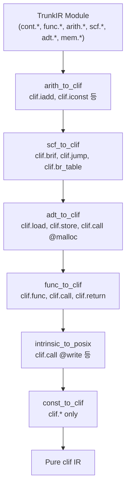

# Lowering Pass Architecture

> 이 문서는 TrunkIR에서 타겟 IR(wasm, clif 등)로의 lowering pass 아키텍처를 정의한다.

## Design Decisions

### 결정 사항 요약

| 항목         | 선택                         | 대안 (채택하지 않음)    |
| ------------ | ---------------------------- | ----------------------- |
| Pass 구조    | Dialect별 분리               | 단일 monolithic lowerer |
| 패턴 적용    | PatternApplicator (fixpoint) | 수동 트리 순회          |
| State 관리   | Salsa tracked analysis       | 수동 캐싱/무효화        |
| 세분화 수준  | Per-function analysis        | Module-level only       |
| Planner 설계 | Immutable (analysis처럼)     | Mutable accumulator     |

---

## Overview

### MLIR-style Dialect별 Pass

Lowering을 단일 monolithic pass로 구현하지 않고, MLIR처럼 dialect별로 분리한다:

```bash
# MLIR 예시
mlir-opt input.mlir \
  -convert-scf-to-cf \
  -convert-func-to-llvm \
  -convert-arith-to-llvm
```

```rust
// Tribute: tribute-wasm-backend/src/pipeline.rs
pub fn lower_to_wasm(db: &dyn Database, module: Module) -> Module {
    let module = passes::adt_to_wasm::lower(db, module);
    let module = passes::scf_to_wasm::lower(db, module);
    let module = passes::func_to_wasm::lower(db, module);
    let module = passes::arith_to_wasm::lower(db, module);
    let module = passes::intrinsic_to_wasi::lower(db, module);
    let module = passes::const_to_wasm::lower(db, module);
    module
}
```

### 장점

1. **관심사 분리**: 각 pass는 단일 dialect만 처리
2. **테스트 용이**: Pass별 독립 unit test 가능
3. **재사용**: 다른 backend도 일부 pass 공유 가능
4. **점진적 lowering**: 중간 상태 검사/디버깅 용이
5. **PatternApplicator 활용**: Focused patterns로 fixpoint iteration

---

## Pass 목록

### adt_to_wasm

ADT 연산을 WasmGC 연산으로 변환.

```text
adt.struct_new  → wasm.struct_new
adt.variant_new → wasm.struct_new + wasm.ref_cast
adt.field_get   → wasm.struct_get
adt.array_get   → wasm.array_get
adt.array_set   → wasm.array_set
```

**필요 Analysis**: `TypeIndexAnalysis` (Type → wasm type index)

### scf_to_wasm

Structured control flow를 Wasm control로 변환.

```text
scf.if    → wasm.if
scf.while → wasm.block(wasm.loop(...))
scf.for   → wasm.block(wasm.loop(...))
scf.case  → wasm.br_table 또는 중첩 wasm.if
```

**필요 Analysis**: 없음 (structural transformation only)

### func_to_wasm

함수 정의 및 호출을 Wasm으로 변환.

```text
func.func          → wasm.func
func.call          → wasm.call
func.return        → wasm.return
func.call_indirect → wasm.call_indirect
func.tail_call     → wasm.return_call
```

**필요 Analysis**: `FunctionIndexAnalysis` (Symbol → function index)

### arith_to_wasm

산술 연산을 타입별 Wasm 명령어로 변환.

```text
arith.add(i32, i32) → wasm.i32_add
arith.add(i64, i64) → wasm.i64_add
arith.add(f64, f64) → wasm.f64_add
arith.mul(...)      → wasm.{i32,i64,f32,f64}_mul
```

**필요 Analysis**: 없음 (type-directed dispatch)

### intrinsic_to_wasi

Intrinsic 함수 호출을 WASI import 호출로 변환.

```text
func.call @std::intrinsics::wasi::preview1::fd_write(...) → wasm.call $wasi_fd_write(...)
func.call @std::intrinsics::wasi::preview1::fd_read(...)  → wasm.call $wasi_fd_read(...)
func.call @std::intrinsics::wasm::memory_grow(...)        → wasm.memory_grow(...)
```

**Intrinsic 경로 규칙**:

- `std::intrinsics::wasi::<version>::*` - WASI 스펙 함수 (버전별)
- `std::intrinsics::wasm::*` - Core Wasm intrinsics (memory_grow 등)
- `std::intrinsics::posix::*` - POSIX syscalls (Cranelift 타겟용)

플랫폼 추상화(`print` 등)는 intrinsic이 아니라 표준 라이브러리에서 처리.

**Note**: `src.call`은 resolve pass에서 이미 `func.call`로 변환됨.

**필요 Analysis**: `WasiPlan`, `DataSegmentPlan`, `MemoryPlan`

### const_to_wasm

상수를 Wasm 상수 또는 data segment 참조로 변환.

```text
func.constant(int)    → wasm.i32_const / wasm.i64_const
func.constant(string) → wasm.i32_const(data_offset)
```

**필요 Analysis**: `DataSegmentPlan`

---

## Pattern-based Rewriting

### PatternApplicator

각 pass는 `PatternApplicator`를 사용하여 fixpoint iteration 수행:

```rust
// trunk-ir/src/rewrite/applicator.rs
pub struct PatternApplicator<'db> {
    patterns: Vec<Box<dyn RewritePattern<'db>>>,
    max_iterations: usize,
}

impl<'db> PatternApplicator<'db> {
    pub fn rewrite_module(
        &mut self,
        db: &'db dyn Database,
        module: Module<'db>,
    ) -> Module<'db> {
        let mut ctx = RewriteContext::new();
        // Fixpoint: patterns를 변화 없을 때까지 반복 적용
        // 각 iteration 후 pending_module_ops를 처리하여
        // 모듈에 추가하고 value remapping 적용
        while self.iteration < self.max_iterations {
            if !self.rewrite_operations(db, module, &mut ctx) {
                break;
            }
        }
        module
    }
}
```

### RewritePattern

패턴은 단일 연산 종류를 처리. `op`는 원본 연산(매칭/속성 접근용)이고,
operand 접근 및 mutation은 모두 `rewriter`를 통해 수행:

```rust
// trunk-ir/src/rewrite/pattern.rs
pub trait RewritePattern<'db> {
    fn match_and_rewrite(
        &self,
        db: &'db dyn Database,
        op: Operation<'db>,
        rewriter: &mut PatternRewriter<'db, '_>,
    ) -> bool;
}
```

`true`를 반환하면 패턴이 매칭되어 mutation이 기록된 것이고,
`false`를 반환하면 매칭되지 않은 것이다.

### PatternRewriter

패턴이 사용하는 단일 인터페이스. Operand 접근(remap+cast 적용됨)과
mutation 메서드를 결합:

```rust
// trunk-ir/src/rewrite/pattern_rewriter.rs
pub struct PatternRewriter<'db, 'ctx> { /* ... */ }

impl<'db, 'ctx> PatternRewriter<'db, 'ctx> {
    // --- Operand access (remapped + cast applied) ---

    /// i번째 operand 조회 (remap 적용됨)
    pub fn operand(&self, i: usize) -> Value<'db>;

    /// 모든 operands 조회
    pub fn operands(&self) -> &[Value<'db>];

    // --- Type access ---

    /// i번째 operand의 타입 조회
    pub fn operand_type(&self, i: usize) -> Type<'db>;

    /// 원본 연산의 i번째 result 타입 조회
    pub fn result_type(&self, db: &'db dyn Database, op: Operation<'db>, i: usize) -> Type<'db>;

    /// 임의 value의 타입 조회
    pub fn get_value_type(&self, db: &'db dyn Database, v: Value<'db>) -> Type<'db>;

    // --- Value resolution ---

    /// Value를 현재 매핑에서 조회
    pub fn lookup_value(&self, v: Value<'db>) -> Value<'db>;

    // --- Mutation methods ---

    /// 현재 연산을 new_op으로 교체
    pub fn replace_op(&mut self, new_op: Operation<'db>);

    /// 교체 연산 앞에 prefix 연산 삽입
    pub fn insert_op(&mut self, op: Operation<'db>);

    /// 연산을 제거하고 results를 주어진 values로 매핑
    pub fn erase_op(&mut self, vals: Vec<Value<'db>>);

    /// 모듈 최상위에 연산 추가 (e.g., outlined 함수)
    pub fn add_module_op(&mut self, op: Operation<'db>);
}
```

**Note:** `OpAdaptor`는 `pub(crate)` 내부 구현이며 패턴에 노출되지 않는다.

### RewriteContext

Value 매핑을 자동 관리하고, module-level 추가 연산을 수집:

```rust
// trunk-ir/src/rewrite/context.rs
pub struct RewriteContext<'db> {
    value_map: HashMap<Value<'db>, Value<'db>>,
    pending_module_ops: Vec<Operation<'db>>,
}

impl<'db> RewriteContext<'db> {
    /// Old value → New value 매핑 조회
    pub fn lookup(&self, value: Value<'db>) -> Value<'db> {
        self.value_map.get(&value).copied().unwrap_or(value)
    }

    /// Old op의 results를 new op의 results로 매핑
    pub fn map_results(
        &mut self,
        db: &'db dyn Database,
        old_op: &Operation<'db>,
        new_op: &Operation<'db>,
    ) {
        for (old_val, new_val) in old_op.results().zip(new_op.results()) {
            self.value_map.insert(old_val, new_val);
        }
    }
}
```

Applicator는 각 iteration 후 `pending_module_ops`를 처리하여 모듈에 추가하고,
전체 value remapping을 적용한다.

### Pass 예시

```rust
// tribute-wasm-backend/src/passes/adt_to_wasm.rs

pub fn lower(db: &dyn Database, module: Module) -> Module {
    // Analysis 조회 (Salsa cached)
    let type_indices = analysis::type_index_analysis(db, module);

    let patterns: Vec<Box<dyn RewritePattern>> = vec![
        Box::new(StructNewPattern::new(type_indices.clone())),
        Box::new(VariantNewPattern::new(type_indices.clone())),
        Box::new(FieldGetPattern::new(type_indices.clone())),
    ];

    PatternApplicator::new(patterns).rewrite_module(db, module)
}

struct StructNewPattern {
    type_indices: TypeIndexAnalysis,
}

impl RewritePattern for StructNewPattern {
    fn match_and_rewrite(
        &self,
        db: &dyn Database,
        op: Operation,
        rewriter: &mut PatternRewriter,
    ) -> bool {
        let Ok(struct_new) = adt::StructNew::from_operation(db, op) else {
            return false;
        };

        let ty = struct_new.struct_type(db);
        let type_idx = self.type_indices.get(db, ty)
            .expect("Type should be in analysis");

        // adt.struct_new → wasm.struct_new
        let new_op = wasm::struct_new(
            db,
            type_idx,
            rewriter.operands(),
        );

        rewriter.replace_op(new_op);
        true
    }
}
```

---

## Salsa-native Analysis

### MLIR과의 비교

MLIR은 C++이라 mutable IR + 수동 캐싱/무효화가 필요하지만, Tribute는 Salsa를 활용:

| MLIR (C++)                          | Tribute (Salsa)                      |
| ----------------------------------- | ------------------------------------ |
| `AnalysisManager::getAnalysis<T>()` | `#[salsa::tracked] fn analysis(...)` |
| 수동 캐싱                           | Salsa 자동 캐싱                      |
| 수동 무효화 tracking                | Salsa dependency graph               |
| `markAllAnalysesPreserved()`        | 필요 없음 (immutable IR)             |

### Invalidation is Free

TrunkIR의 Operation은 immutable Salsa tracked struct이므로, 무효화가 자동:

```rust
// Module이 바뀌면 Salsa가 자동으로 analysis 재계산
let analysis_v1 = type_index_analysis(db, module_v1);  // 계산

let module_v2 = adt_to_wasm::lower(db, module_v1);     // 새 module

let analysis_v2 = type_index_analysis(db, module_v2);  // 재계산 (다른 module)
// analysis_v1 캐시는 그대로 유지 (module_v1용)
```

### Analysis 정의

```rust
// tribute-wasm-backend/src/analysis/type_indices.rs

/// Type → Wasm type index 매핑
#[salsa::tracked]
pub struct TypeIndexAnalysis<'db> {
    #[returns(ref)]
    type_to_index: HashMap<Type<'db>, u32>,
}

impl<'db> TypeIndexAnalysis<'db> {
    pub fn get(&self, db: &'db dyn Database, ty: Type<'db>) -> Option<u32> {
        self.type_to_index(db).get(&ty).copied()
    }
}

#[salsa::tracked]
pub fn type_index_analysis<'db>(
    db: &'db dyn Database,
    module: Module<'db>,
) -> TypeIndexAnalysis<'db> {
    let mut type_to_index = HashMap::new();
    let mut next_index = 0;

    // Per-function analysis 조합
    for op in module.ops(db) {
        if let Ok(func) = func::Func::from_operation(db, op) {
            let func_types = function_type_analysis(db, func);

            for ty in func_types.types_used(db) {
                type_to_index.entry(*ty).or_insert_with(|| {
                    let idx = next_index;
                    next_index += 1;
                    idx
                });
            }
        }
    }

    TypeIndexAnalysis::new(db, type_to_index)
}
```

---

## Fine-grained Analysis

### Per-Function 세분화

Module-level analysis 대신 function-level로 세분화하면 Salsa 캐싱 효율 극대화:

```rust
// Coarse-grained: 모든 함수 스캔
#[salsa::tracked]
fn module_type_analysis(db: &dyn Database, module: Module) -> ModuleTypeInfo {
    for op in module.ops(db) {
        // 모든 op 스캔
    }
}

// Fine-grained: 함수별 분리
#[salsa::tracked]
fn function_type_analysis(db: &dyn Database, func: func::Func) -> FunctionTypeInfo {
    // 이 함수 body만 스캔
    let mut types_used = HashSet::new();
    for block in func.body(db).blocks(db) {
        for op in block.ops(db) {
            // Collect types
        }
    }
    FunctionTypeInfo::new(db, types_used)
}

// Module-level은 function-level 조합
#[salsa::tracked]
fn module_type_analysis(db: &dyn Database, module: Module) -> ModuleTypeInfo {
    let mut all_types = HashSet::new();

    for op in module.ops(db) {
        if let Ok(func) = func::Func::from_operation(db, op) {
            // Per-function analysis 재사용
            let func_info = function_type_analysis(db, func);
            all_types.extend(func_info.types_used(db).iter().copied());
        }
    }

    ModuleTypeInfo::new(db, all_types)
}
```

**Salsa의 마법:**

- 100개 함수 중 1개만 바뀌면 → 99개는 캐시 재사용, 1개만 재계산
- MLIR은 이를 수동 tracking 해야 하지만 Salsa는 자동

---

## Planner as Analysis

### Mutable Planner → Immutable Plan

"Mutable planner"도 사실 pure function으로 계산 가능:

```rust
// Before: Mutable planner (안 좋음)
struct DataSegmentPlanner {
    segments: Vec<Vec<u8>>,
    string_to_offset: HashMap<String, u32>,
    next_offset: u32,
}

impl DataSegmentPlanner {
    fn allocate_string(&mut self, s: &str) -> u32 {
        // Mutates self
    }
}

// After: Immutable plan (Salsa tracked)
#[salsa::tracked]
pub struct DataSegmentPlan<'db> {
    #[returns(deref)]
    segments: Vec<Vec<u8>>,

    #[returns(ref)]
    string_to_offset: HashMap<String, u32>,

    total_size: u32,
}

#[salsa::tracked]
pub fn data_segment_plan<'db>(
    db: &'db dyn Database,
    module: Module<'db>,
) -> DataSegmentPlan<'db> {
    // Pure function: module → plan
    let mut segments = Vec::new();
    let mut string_to_offset = HashMap::new();
    let mut offset = 0;

    for string_literal in collect_string_literals(db, module) {
        if !string_to_offset.contains_key(&string_literal) {
            string_to_offset.insert(string_literal.clone(), offset);
            let bytes = string_literal.into_bytes();
            offset += bytes.len() as u32;
            segments.push(bytes);
        }
    }

    DataSegmentPlan::new(db, segments, string_to_offset, offset)
}
```

### WasiPlan

```rust
#[salsa::tracked]
pub struct WasiPlan<'db> {
    /// 필요한 WASI import 목록 (e.g., "fd_write", "fd_read")
    #[returns(ref)]
    required_imports: HashSet<Symbol<'db>>,
}

impl<'db> WasiPlan<'db> {
    pub fn needs(&self, db: &'db dyn Database, name: &str) -> bool {
        let sym = Symbol::new(db, name);
        self.required_imports(db).contains(&sym)
    }
}

#[salsa::tracked]
pub fn wasi_plan<'db>(
    db: &'db dyn Database,
    module: Module<'db>,
) -> WasiPlan<'db> {
    let mut required = HashSet::new();

    // WASI prefix (Symbol에 "::"로 구분된 경로로 저장됨)
    let wasi_prefix = "std::intrinsics::wasi::preview1::";

    for op in module.all_operations(db) {
        if let Ok(call) = func::Call::from_operation(db, op) {
            let callee = call.callee(db);  // Symbol
            callee.with_str(|s| {
                if let Some(name) = s.strip_prefix(wasi_prefix) {
                    // name: 마지막 segment (e.g., "fd_write")
                    required.insert(Symbol::from_dynamic(name));
                }
            });
        }
    }

    WasiPlan::new(db, required)
}
```

### MemoryPlan

```rust
#[salsa::tracked]
pub struct MemoryPlan<'db> {
    needs_memory: bool,
    initial_pages: u32,
    max_pages: Option<u32>,
}

#[salsa::tracked]
pub fn memory_plan<'db>(
    db: &'db dyn Database,
    module: Module<'db>,
) -> MemoryPlan<'db> {
    let data_plan = data_segment_plan(db, module);
    let wasi = wasi_plan(db, module);

    // 메모리가 필요한 조건: data segment 있거나 메모리 사용하는 WASI 함수
    let needs_memory = data_plan.total_size(db) > 0
        || wasi.needs(db, "fd_write")
        || wasi.needs(db, "fd_read");

    let initial_pages = if needs_memory {
        // data segment 크기 기반으로 초기 페이지 계산
        ((data_plan.total_size(db) as usize + 65535) / 65536).max(1) as u32
    } else {
        0
    };

    MemoryPlan::new(db, needs_memory, initial_pages, None)
}
```

---

## Analysis 모듈 구조

```text
tribute-wasm-backend/
├── src/
│   ├── lib.rs
│   ├── pipeline.rs           # lower_to_wasm entry point
│   │
│   ├── analysis/
│   │   ├── mod.rs            # re-exports
│   │   ├── type_indices.rs   # TypeIndexAnalysis
│   │   ├── func_indices.rs   # FunctionIndexAnalysis
│   │   ├── data_segments.rs  # DataSegmentPlan
│   │   ├── wasi.rs           # WasiPlan
│   │   ├── memory.rs         # MemoryPlan
│   │   └── function_info.rs  # Per-function analysis
│   │
│   └── passes/
│       ├── mod.rs
│       ├── adt_to_wasm.rs
│       ├── scf_to_wasm.rs
│       ├── func_to_wasm.rs
│       ├── arith_to_wasm.rs
│       ├── intrinsic_to_wasi.rs
│       └── const_to_wasm.rs
```

---

## Pass Pipeline

### Salsa Tracked Pipeline

```rust
// tribute-wasm-backend/src/pipeline.rs

#[salsa::tracked]
pub fn lower_to_wasm<'db>(
    db: &'db dyn Database,
    module: Module<'db>,
) -> Module<'db> {
    // Analysis는 각 pass 내에서 필요할 때 조회
    // Salsa가 자동으로 캐싱 및 의존성 추적

    let module = passes::adt_to_wasm::lower(db, module);
    let module = passes::scf_to_wasm::lower(db, module);
    let module = passes::func_to_wasm::lower(db, module);
    let module = passes::arith_to_wasm::lower(db, module);
    let module = passes::intrinsic_to_wasi::lower(db, module);
    let module = passes::const_to_wasm::lower(db, module);

    module
}

/// 최종 emission에 필요한 metadata 조회
pub fn wasm_metadata<'db>(
    db: &'db dyn Database,
    module: Module<'db>,
) -> WasmMetadata<'db> {
    WasmMetadata {
        type_indices: analysis::type_index_analysis(db, module),
        func_indices: analysis::function_index_analysis(db, module),
        data_segments: analysis::data_segment_plan(db, module),
        wasi_plan: analysis::wasi_plan(db, module),
        memory_plan: analysis::memory_plan(db, module),
    }
}
```

### 점진적 Lowering

```text
High-level IR
    │ [adt.struct_new, adt.variant_new, scf.if, func.call, arith.add]
    │
    ▼ adt_to_wasm
    │ [wasm.struct_new, scf.if, func.call, arith.add]
    │
    ▼ scf_to_wasm
    │ [wasm.struct_new, wasm.if, func.call, arith.add]
    │
    ▼ func_to_wasm
    │ [wasm.struct_new, wasm.if, wasm.call, arith.add]
    │
    ▼ arith_to_wasm
    │ [wasm.struct_new, wasm.if, wasm.call, wasm.i32_add]
    │
    ▼ intrinsic_to_wasi
    │ [wasm.* only, WASI imports configured]
    │
    ▼ const_to_wasm
    │ [wasm.* only, data segments allocated]
    │
Pure wasm IR
```

---

## Native (Cranelift) Lowering Passes

WASM lowering과 대칭 구조로 native 타겟을 위한 pass를 정의한다.

### func_to_clif

함수 정의 및 호출을 Cranelift 연산으로 변환.

```text
func.func          → clif.func
func.call          → clif.call
func.return        → clif.return
func.call_indirect → clif.call_indirect
func.constant      → clif.symbol_addr (함수 포인터)
```

**필요 Analysis**: 없음

### arith_to_clif

산술 연산을 타입별 Cranelift 명령어로 변환.

```text
arith.add(i32, i32) → clif.iadd
arith.add(f64, f64) → clif.fadd
arith.mul(...)      → clif.imul / clif.fmul
arith.const(int)    → clif.iconst
arith.const(float)  → clif.f64const
```

**필요 Analysis**: 없음 (type-directed dispatch)

### scf_to_clif

Structured control flow를 CFG 기반 제어 흐름으로 변환.

```text
scf.if    → clif.brif + then/else/merge blocks
scf.while → loop_header + body + clif.jump
scf.for   → loop_header + body + clif.jump
scf.case  → clif.br_table 또는 연쇄 clif.brif
```

WASM의 structured control flow와 달리 Cranelift는 CFG를 직접 사용하므로
block/loop 래핑이 불필요하다.

**필요 Analysis**: 없음 (structural transformation only)

### adt_to_clif

ADT 연산을 포인터 기반 메모리 연산으로 변환.

```text
adt.struct_new(fields...) → clif.call @malloc + clif.store at offsets
adt.struct_get(ref, field) → clif.load(ref, offset)
adt.variant_new(tag, payload) → clif.call @malloc + clif.store tag + payload
adt.array_get(ref, index) → clif.load(ref, index * elem_size + header_size)
```

**ADT 메모리 레이아웃:**

```text
Struct: [fields in order, naturally aligned]
Enum:   [tag: i32] [padding] [payload: max(variant sizes)]
Array:  [length: i64] [elements...]
```

**필요 Analysis**: `StructLayoutAnalysis` (타입 → 필드 오프셋/크기)

### intrinsic_to_posix

Intrinsic 함수 호출을 POSIX syscall로 변환.

```text
func.call @std::intrinsics::posix::write(...) → clif.call @write(...)
func.call @std::intrinsics::posix::read(...)  → clif.call @read(...)
```

**필요 Analysis**: 없음

### const_to_clif

상수를 Cranelift 상수 또는 data section 참조로 변환.

```text
func.constant(int)    → clif.iconst
func.constant(float)  → clif.f64const
func.constant(string) → clif.symbol_addr(@data_symbol)
```

**필요 Analysis**: `DataSectionPlan` (문자열 → data symbol)

### Native Pass Pipeline



---

## PatternApplicator 설계 철학

### Stateless by Design

PatternApplicator는 의도적으로 stateless:

1. **Composability**: 패턴들이 독립적이고 조합 가능
2. **Predictability**: 패턴 적용 순서가 상태에 의존하지 않음
3. **Testability**: 각 패턴을 독립적으로 테스트 가능

### State는 Analysis로 분리

```rust
// ❌ 잘못된 접근: Pattern 내부에 mutable state
struct BadPattern {
    counter: RefCell<u32>,  // 상태 누적
}

// ✅ 올바른 접근: Analysis에서 미리 계산
struct GoodPattern {
    type_indices: TypeIndexAnalysis,  // Immutable, 미리 계산됨
}
```

### 왜 수동 lowering 대신 PatternApplicator?

이전에 수동 `WasmLowerer`를 사용했던 이유:

1. Module-level state 필요 (type_registry, data_segments 등)
2. 복잡한 structural transformation (1-to-many)
3. Tree 순회 vs flat operation list

하지만 Analysis 분리 후:

1. State는 Salsa analysis로 분리 → 읽기 전용
2. 1-to-many expansion은 `insert_op()` + `replace_op()` 조합으로 처리
3. Module-level 추가(outlined 함수 등)는 `add_module_op()`으로 처리
4. PatternApplicator가 자동으로 region 재귀

---

## Open Questions

1. **Per-operation Analysis**: Operation 단위 분석이 필요한 경우?
    - 현재는 function/module 단위
    - 너무 세분화하면 오버헤드

2. **Analysis Dependencies**: Analysis 간 의존성 관리
    - `memory_plan`이 `data_segment_plan`과 `wasi_plan`에 의존
    - Salsa가 자동 처리하지만 순환 의존 주의

3. **Parallel Pattern Application**: 여러 패턴 병렬 적용?
    - 현재는 순차 적용
    - 패턴 간 충돌 가능성 고려 필요

4. **Verification Pass**: Lowering 완료 후 검증?
    - 모든 high-level ops가 제거되었는지 확인
    - Dialect invariant 검사

---

## References

- [MLIR: A Compiler Infrastructure for the End of Moore's Law](https://arxiv.org/abs/2002.11054)
- [MLIR Pattern Rewriting](https://mlir.llvm.org/docs/PatternRewriter/)
- [Salsa: A generic framework for on-demand, incrementalized computation](https://github.com/salsa-rs/salsa)
